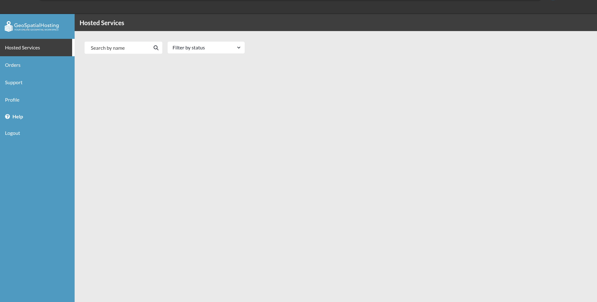

# Access Dashboard

1. **Dashboard:** Users can access the dashboard by clicking on this link from the top navigation bar, this will redirects the users to the dashboard page.

* **[Hosted Services](./hosted_services.md):** Users can use this as a walkthrough for the hosted services page.

* **[Agreements](./agreements.md):** Users can use this as a walkthrough for the agreements page.

* **[Orders](./orders.md)**: Users can use this as a walkthrough for the order page.

* **[Support](./supports/index.md):** Users can use this as a walkthrough for the support page.

* **[Profile](./profile/index.md):** Users can use this as a walkthrough for the profile page.

* **Logout:** Users can use this to logout from the platform.
