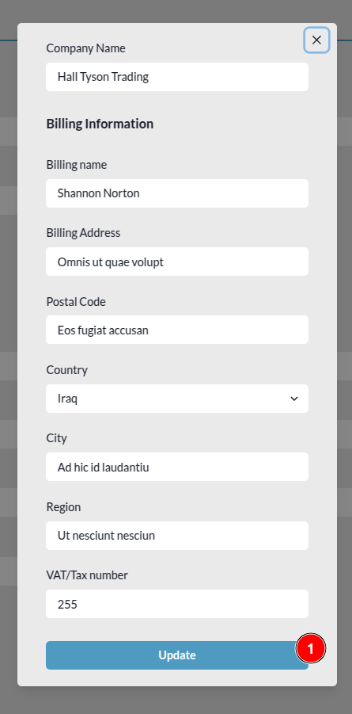

# Edit Profile

## Update Avatar

1. **Update Avatar:** Users can click this button to update their avatar. This will open the file explorer, allowing them to select a profile image.

1. **Cancel:** Users can click this button to close the file explorer.

2. **Select:** After selecting the image users can click on this button to upload the image.

## Update Personnel Information

1. **Update Profile:** To update their profile information, users can click this button after entering the latest details in the input fields. For example, to update the name, enter the new name in the name input field and then click the `Update Profile` button.

* After clicking the `Update Profile` button, users will receive a notification toast with the message `Your profile has been successfully updated`. This toast will automatically disappear after some time. To close it manually, click on the `x` icon at the top right corner of the toast.

  

## Update Password

1. **Update Password:** Users can click on this button to update the password, this button will open a password update form.

    

    * **Old Password:** Enter the current password in this field.

    * **New Password:** Enter the new password in this field.

    * **Repeat New Password:** Enter the new password again in this field to confirm it.

    * **Change Password:** After entering the new password and confirming it, click this button to update the password.

    * **Password do not match:**

      

        1. **Passwords do not match:** If the new password and the repeated new password do not match, users will receive an error message indicating the mismatch.

    * **Old password is not correct:**

      

        1. **Old password is not correct:** If the old password entered is incorrect, users will receive an error message indicating the incorrect old password.

    * **Success:**

      Users will receive this notification if their password is reset successfully. They will be logged out from the site and redirected to the home page.

      

## Create Company

1. **Create Company:** This button allows users to create company.

  

  * **Company Name:** Enter the name of the company in this field.

  * **Billing Name:** Enter the billing name of the company in this field.

  * **Billing Address:** Enter the billing address of the company in this field.

  * **Postal Code:** Enter the postal code of the location in this field.

  * **Country:** Select the country of the company from the dropdown list.

  * **City:** Enter the city of the company in this field.

  * **Region:** Enter the region of the company in this field.

  * **VAT/Tax number:** Enter the VAT/Tax number of the company in this field.

  * **Create:** After filling in all the details click on this button to submit the request.

    * **Error:** Users will receive this error they submit the request without filling in the form.
    
      
    
    * **Success:** Users will receive this notification if their company is created successfully.

      

## Edit Existing Company Details

1. **Company Name:** By clicking on the company name, users can edit the information of the respective company. After clicking on the company name, a form will appear containing the company's details.

1. **Update:** Fill the latest information in the form and click on this button to update the company details.
