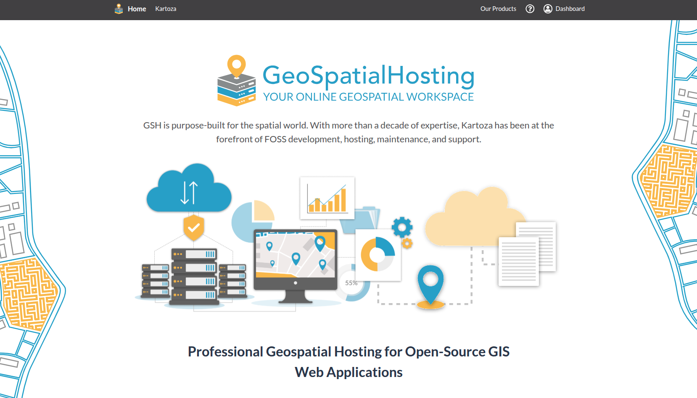
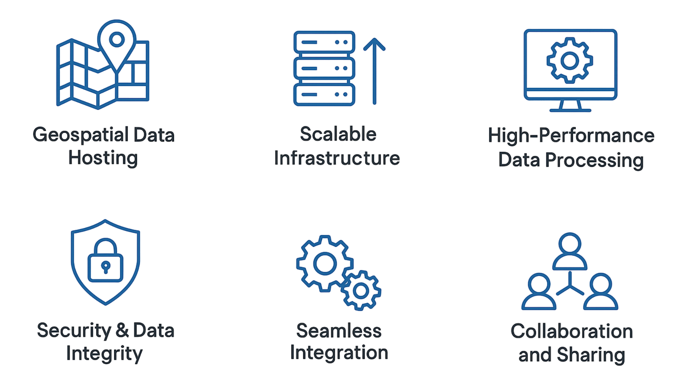
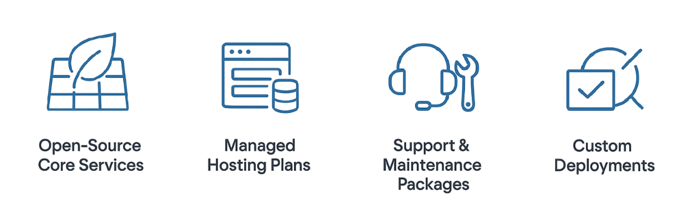

## Overview

**GeoSpatialHosting (GSH)** is a secure, scalable, and high-performance platform for deploying and managing open-source geospatial tools like [GeoNode](https://geonode.org), [G3W-Suite](https://g3w-suite.readthedocs.io/), and [GeoServer](https://geoserver.org). Whether you’re a spatial analyst, developer, NGO, or municipality — GSH lets you focus on your project, not your infrastructure.

 

  
  

    Image credit: <a href="https://geohosting.sta.do.kartoza.com/" target="_blank">GeoSpatialHosting</a>
  

## Why Choose GSH?

Deploying spatial platforms can be time-consuming and technically challenging. GSH solves this by offering:

- **Pre-configured GIS environments** ready for production
- **One-click deployments** for GeoNode, GeoServer, G3W‑Suite
- **Fully managed infrastructure** maintained by FOSS GIS experts

 

## What Makes GSH Different?

GSH is purpose-built for the geospatial community. We combine deep FOSS experience with infrastructure excellence to offer a seamless hosting experience.

 

**Key Advantages:**

<table class="my-table-style">
  <thead>
    <tr>
      <th>Advantage</th>
      <th>Description</th>
    </tr>
  </thead>
  <tbody>
    <tr>
      <td>Geospatial-First Infrastructure</td>
      <td>Built from the ground up for spatial workloads — optimized to host maps, data layers, and GIS services that perform out of the box.</td>
    </tr>
    <tr>
      <td>Fully Managed Deployments</td>
      <td>We handle server setup, updates, monitoring, backups, and maintenance — so you can focus entirely on your geospatial work.</td>
    </tr>
    <tr>
      <td>Rapid Setup</td>
      <td>Spin up production-ready GIS stacks in minutes with zero DevOps — no scripts, no command lines, no headaches.</td>
    </tr>
    <tr>
      <td>Enterprise-Grade Security</td>
      <td>All deployments include HTTPS, access controls, and encrypted storage — for peace of mind.</td>
    </tr>
  </tbody>
</table>

 

## Key Concepts

<table class="my-table-style">
  <thead>
    <tr>
      <th>Concept</th>
      <th>Description</th>
    </tr>
  </thead>
  <tbody>
    <tr>
      <td>Geospatial Data Hosting</td>
      <td>Fast, secure access to large spatial datasets like GIS layers, satellite imagery, and vector maps.</td>
    </tr>
    <tr>
      <td>Scalable Infrastructure</td>
      <td>Flexible architecture that grows with your needs — from small-scale apps to enterprise deployments.</td>
    </tr>
    <tr>
      <td>High-Performance Data Processing</td>
      <td>Optimized for speed — enabling real-time rendering, querying, and spatial analysis without delays.</td>
    </tr>
    <tr>
      <td>Security & Data Integrity</td>
      <td>End-to-end encryption, strict access control, and regular backups to ensure your data remains safe and consistent.</td>
    </tr>
    <tr>
      <td>Seamless Integration</td>
      <td>Works with your existing tools — including desktop GIS, web mapping libraries, and open APIs.</td>
    </tr>
    <tr>
      <td>Collaboration & Sharing</td>
      <td>Securely share data and collaborate in real-time across teams, departments, or organizations.</td>
    </tr>
  </tbody>
</table>

 

  

## Products & Services

GSH offers ready-to-use and customizable hosting options for your spatial applications:

- **Open-Source Core Services**

    Instantly launch trusted tools like GeoNode, G3W‑Suite, and GeoServer.

     

- **Managed Hosting Plans**

    From lightweight packages to large RAM setups — fully managed with backups and monitoring.

     

- **Custom Deployments**

    On your cloud, on-premise, or hybrid — powered by our Docker–Linux–Rancher stack.

     

- **Support & Maintenance Packages**

    System tuning, upgrades, SLA-based response, and issue resolution by our expert team.

  

## Deployment Workflow

Getting started is simple:

1. **Pick your stack** – GeoNode, GeoServer, or G3W‑Suite
2. **Choose a plan** – from personal to enterprise-scale
3. **Let us deploy** – we handle provisioning, config, security, and backups
4. **Start working** – get admin access and publish maps, serve data, or collaborate

 

Optional add-ons include domain setup, QGIS styling integration, and dedicated support tiers.

  

## Pricing Plans

Choose a hosting tier that matches your project:

<table class="my-table-style">
  <thead>
    <tr>
      <th>Plan</th>
      <th>Basic</th>
      <th>Advanced</th>
      <th>Gold</th>
    </tr>
  </thead>
  <tbody>
    <tr>
      <td>Best for</td>
      <td>Personal use, learning, or small PoC projects</td>
      <td>NGOs, academic research, and small teams</td>
      <td>Enterprise, government, and high-availability use</td>
    </tr>
    <tr>
      <td>Deployment</td>
      <td>Single-instance</td>
      <td>Multi-instance</td>
      <td>Full-stack deployments with SLAs</td>
    </tr>
    <tr>
      <td>Resources</td>
      <td>Shared infrastructure</td>
      <td>Balanced resources</td>
      <td>Dedicated, high-performance setup</td>
    </tr>
    <tr>
      <td>Pricing</td>
      <td>Affordable monthly rate</td>
      <td>Optimized for value</td>
      <td>Premium pricing with white-glove service</td>
    </tr>
  </tbody>
</table>

👉 [View full pricing & features](https://geospatialhosting.com/)

 

## Need a Custom Setup?

No problem. [Contact our team](https://kartoza.com/contact-us/new) — we’ll help design and deploy the right GSH solution for your needs.

 

## Dedicated Customer Support

Our support team is available for any technical challenges — from setup to optimization. With a decade of experience in FOSS GIS, we’re here to help your stack run smoothly.

 
