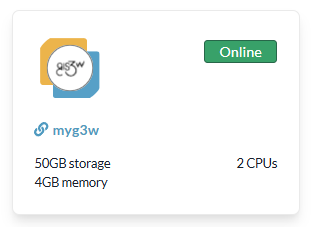
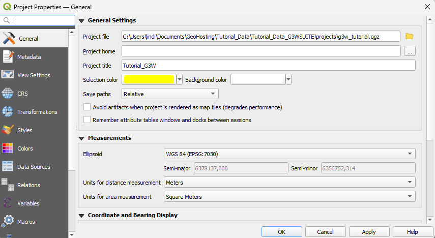

# Navigating the Dashboard

The **home page** serves as the main entry point to the platform. It includes a customizable welcome message and intuitive navigation menus that provide access to various functionalities.

 

**Right-Side Panel Menu**

This panel contains quick-access links:

- **About It** – view service-related information
- **Maps** – explore available WebGIS services
- **Login** – access additional services

 

## About It

This section can display a short description and key contact details relevant to your organization or project.

 

  
  

    Image credit: <a href="https://g3wsuite.it/en/g3w-suite-publish-qgis-projects/" target="_blank">G3W-SUITE</a>
  

 

## Maps

G3W-SUITE organizes WebGIS services in hierarchical containers:

- **Cartographic Macrogroups** – top-level thematic categories
- **Cartographic Groups** – subcategories containing specific services

 

**Browsing Maps:**

1. Click **Maps** in the panel.
2. Available macrogroups appear under **Thematic Groups**.
3. Select a macrogroup to view its associated **Groups**.
4. Click a group to list individual **WebGIS services**.

 

  
  

    Image credit: <a href="https://g3wsuite.it/en/g3w-suite-publish-qgis-projects/" target="_blank">G3W-SUITE</a>
  

 

## Administration Panel

The **Administration Panel** is the control center for managing user accounts, groups, and access policies.

 

Once logged in, click the **Backend** button in the top-right corner, or use the **Gear** icon → **Django Administration**.

 

  
  

    Image credit: <a href="https://g3wsuite.it/en/g3w-suite-publish-qgis-projects/" target="_blank">G3W-SUITE</a>
  

 

### Top Bar Controls

- **Frontend:** Return to the public-facing portal
- **Username:** Access your profile or log out
- **Language:** Change interface language
- **Gear icon:**
  - Edit General Data
  - Django Administration
  - Files (File Manager)

 

### Left-Side Navigation Menu

Use the sidebar to navigate administration functions:

- **Dashboard:** Overview & quick links
- **Macro Cartographic Groups:** Create/manage thematic containers
- **Cartographic Groups:** Create/manage service groups
- **Users:** Create, edit, and delete user accounts; assign users to groups

 

### Central Dashboard Area

The central panel displays:

- **Dashboard Widget:** High-level overview
- **Quick Links:** Direct access to Cartographic Groups, Macro Cartographic Groups, Users
- **Status Panels:** Counts of existing groups, users, and services
