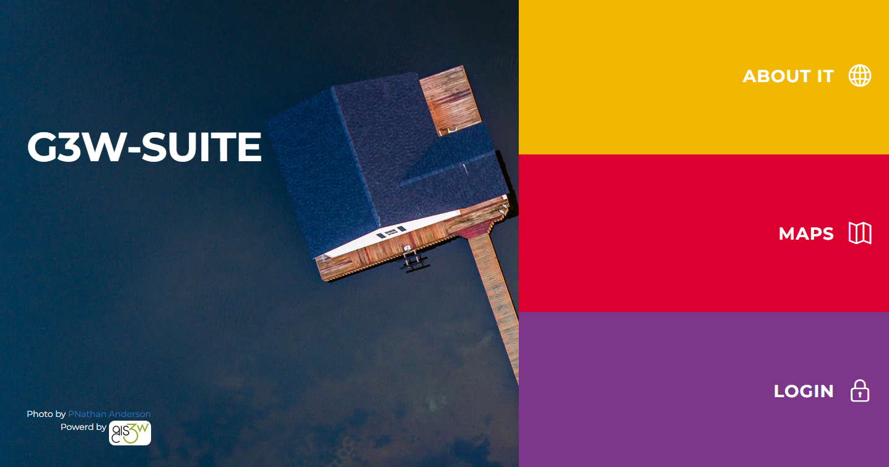

# First Log In & Setting Your Password

To access the Administration Panel, log in using the credentials generated on the GeoSpatial Hosting Dashboard:

1. Click **Login** in the portal side panel.
2. Enter your credentials:
   - **Username:** `admin`
   - **Password:** *(paste your generated password)*
3. Click **Sign In**.

 

  
  

    Image credit: <a href="https://g3wsuite.it/en/g3w-suite-publish-qgis-projects/" target="_blank">G3W-SUITE</a>
  

 

**Changing your initial password (recommended):**

1. Click your username in the top bar and select **Change password**.
2. Enter your current password and your new password twice.
3. Click **Change password** to save.

 

> **Hint:** Choose a strong, unique password and store it securely.
