# Quickstart: 5-Minute Tutorial

## Overview

This tutorial is centered around a QGIS project designed to manage a layer representing a collection of buildings within a specific geographic area.

Beyond **spatial data**, the project also handles a wide range of **attribute information**, including maintenance records, using a 1:n relational structure to allow each building to be associated with multiple maintenance entries.

<br>

Throughout the tutorial, you will gain **practical skills** in:

1. **Customizing** the graphic and functional elements of the base QGIS project.
2. **Publishing** the project as a WebGIS service using G3W-SUITE.
3. **Creating** custom search tools for efficient data exploration.
4. **Integrating** interactive charts using the DataPlotly plugin.
5. **Enabling** online editing, including:

      - Custom form layouts
      - Specialized widgets for improved user interaction

     <br>

      <div style="text-align: center;">
       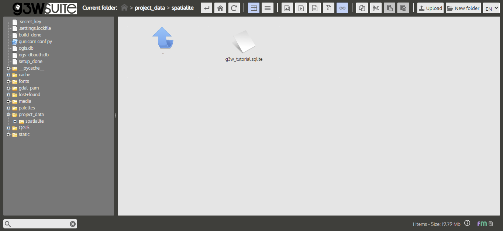
      </div>

<br>

> **Note:** This tutorial aims to demonstrate how a real-world GIS project can be fully managed through G3W-SUITE and QGIS.

---

## Data Preperation

This tutorial is based on a modified dataset and QGIS 3.34.x LTR project from the official [G3W-SUITE](https://g3w-suite.readthedocs.io/en/latest/index.html) documentation website. Download the **Tutorial Data** using the link below:

- [`Tutorial_Data_G3WSUITE.zip` Download](https://github.com/kartoza/GeoHosting/tree/main/docs/src/products/tutorial_data/Tutorial_Data_G3WSUITE.zip)

<br>

> **Note:** You can download the original data from the [Download Demo Data](https://g3w-suite.readthedocs.io/en/latest/demo.html#download-demo-data) section of the G3W-SUITE Documentation

<br>

### Data Preperation Overview

The `Tutorial_Data_G3WSUITE` folder contains images and the following **three subdirectories**:

<br>

📁 **`projects/`**

- Contains the QGIS project file: `g3w_tutorial.qgs`
- The project is fully optimized for this tutorial.

 <br>

📁 **`plots/`**

- Contains plot definitions created using the DataPlotly plugin, saved in `.xml` format.

 <br>

📁 **`project_data/spatialite/`**

- Contains the SpatiaLite database: `g3w_tutorial.sqlite`
- This database stores the core data used in the project.

 <br>

Inside the **`g3w_tutorial.sqlite`** file, you’ll find the following layers:

 <br>

 | Layer Name          | Type    | Description                                                      |
 | ------------------- | ------- | ---------------------------------------------------------------- |
 | `buildings`         | Polygon | Main reference layer for editing building features               |
 | `maintenance_works` | Table   | Records of maintenance activities linked to individual buildings |
 | `buildings_rating`  | Table   | Annual ratings or assessments of buildings                       |
 | `roads`             | Line    | Road network used to assign addresses to buildings               |
 | `work_areas`        | Polygon | Work zone boundaries used to define geo-constraints              |
 | `type_subtype`      | Table   | Lookup table for building type and subtype values                |

 <br>

The QGIS project (based on QGIS 3.34.x LTR) is pre-configured with the following **features**:

1. **Categorized symbology** for the:

       - `buildings` layer based on the `type` field.

       <br>

2. **1:n relationships defined between:**

       - `buildings` ↔ `maintenance_works`
       - `buildings` ↔ `buildings_rating`

       <br>

3. **Pre-built query forms for:**

       - `buildings` layer
       - `maintenance_works` table

       <br>

4. **Predefined editing widgets for:**

     - `buildings`, `maintenance_works`, and `buildings_rating` attributes

     <br>

5. **Four print layouts:**

     - Two standard layout templates
     - Two atlas layout templates using features from the buildings layer

<br>

<div style="text-align: center;">
  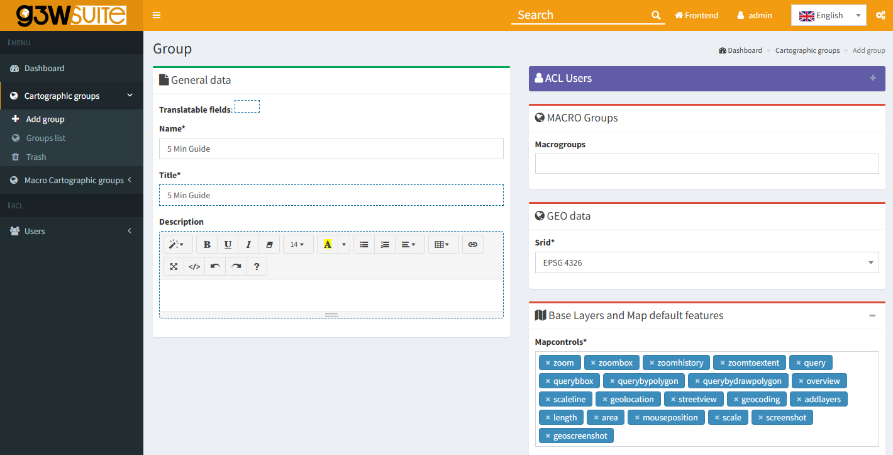
  <div style="font-size: 0.8em; color: gray; margin-top: 4px;">
    Image credit: <a href="https://qgis.org/" target="_blank">QGIS</a>
  </div>
</div>

---

### Data Preperation Exercise

Before you can publish your QGIS project to the WebGIS platform, there are **two essential steps** you **MUST** complete:

1. **Update the Project Title**

       This title will be used as the WebGIS service ID. If not updated, your service may be misidentified or conflict with existing services.

       <br>

2. **Upload the SpatiaLite database to the File Manager**

       This ensures that G3W-SUITE can access the data sources used in your QGIS project. Without it, layers may not display correctly.

       <br>

---

**Steps to update the project title:**

1. Open your QGIS project.

2. Go to the **Project** menu.

3. Select **Properties...**

4. Under the **General tab**, locate the **Project Title** field.

5. Enter a unique and descriptive title for your project.

6. Click **OK** to apply the changes.

      <br>

      **Make sure the title:**

      - Reflects the content or purpose of your project.
      - Does not contain special characters or excessive spacing.
      - Is short but specific enough to identify the service in the WebGIS environment.

<br>

<div style="text-align: center;">
  
  <div style="font-size: 0.8em; color: gray; margin-top: 4px;">
    Image credit: <a href="https://qgis.org/" target="_blank">QGIS</a>
  </div>
</div>

<br>

> **Note:** For more details, refer to the [QGIS: project settings](https://g3w-suite.readthedocs.io/en/latest/projectsettings.html#qgis-project-settings) section of the official G3W documentation.

---

**Uploading the SpatiaLite database to the File Manager**

1. Open a web browser and navigate to:

      ```bash
      http://<application_name>.sta.do.kartoza.com/g3w
      ```

      <br>

2. Log in to G3W-SUITE using your **administrator credentials**.

      - **Username:** `admin`
      - **Password:** `*generate from dashboard*`

      <br>

      > **Hint:** Need help finding your credentials? See the section: [Using the Kartoza GeoSpatialHosting Dashboard](https://kartoza.github.io/GeoHosting/products/g3w/guide/#using-the-kartoza-geospatialhosting-dashboard)

      <br>

3. Once authenticated, navigate to the **Administration Panel**

      <br>

      > **Hint:** Need help navigating to the Administration Panel? Refer to the [Administration Panel](https://kartoza.github.io/GeoHosting/products/g3w/guide/#administration-panel) section.

      <br>

4. In the top-bar, click the **Gear** icon.

      <br>

5. Under **File Manager**, select **Files**.

      <br>

      <div style="text-align: center;">
       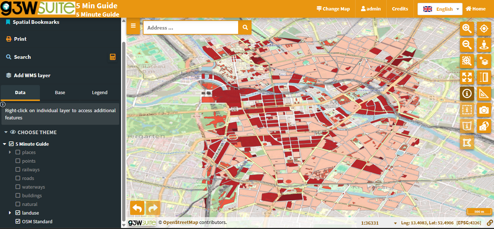
       <div style="font-size: 0.8em; color: gray; margin-top: 4px;">
       Image credit: <a href="https://g3wsuite.it/en/g3w-suite-publish-qgis-projects/" target="_blank">G3W-SUITE</a>
       </div>
      </div>

      <br>

6. From the **Home** folder (or the left-hand panel), navigate to the `project_data` folder.

      <br>

7. In the top navigation bar, click the **New Folder** button.

      <br>

      <div style="text-align: center;">
       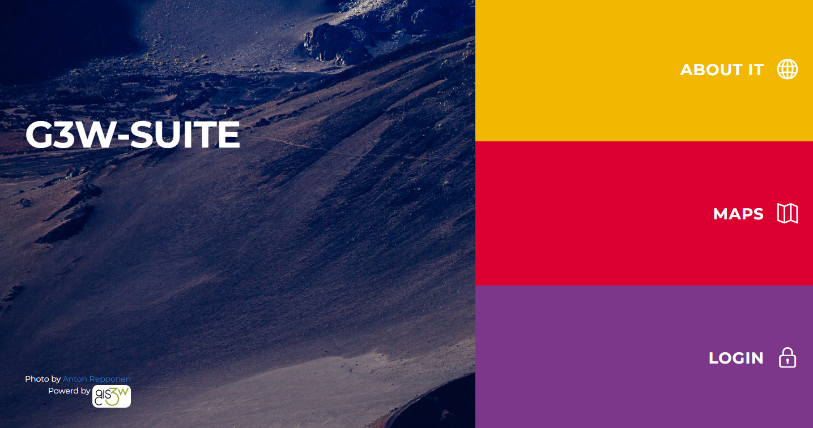
       <div style="font-size: 0.8em; color: gray; margin-top: 4px;">
       Image credit: <a href="https://g3wsuite.it/en/g3w-suite-publish-qgis-projects/" target="_blank">G3W-SUITE</a>
       </div>
      </div>

      <br>

8. Name your new folder `spatialite` and click **Create Folder**.

      <br>

      <div style="text-align: center;">
       
       <div style="font-size: 0.8em; color: gray; margin-top: 4px;">
       Image credit: <a href="https://g3wsuite.it/en/g3w-suite-publish-qgis-projects/" target="_blank">G3W-SUITE</a>
       </div>
      </div>

      <br>

      > **Note:** Make sure the file path matches the one specified in your QGIS project.

      <br>

9. Open your newly created folder, then in the top bar, click **Upload**.

      <br>

      <div style="text-align: center;">
       
       <div style="font-size: 0.8em; color: gray; margin-top: 4px;">
       Image credit: <a href="https://g3wsuite.it/en/g3w-suite-publish-qgis-projects/" target="_blank">G3W-SUITE</a>
       </div>
      </div>

      <br>

10. Click inside the file drop area to open your system file explorer.

      <br>

11. Select the `g3w_tutorial.sqlite` file from the `project_data -> spatialite` folder and click **Upload**.

      <br>

      <div style="text-align: center;">
       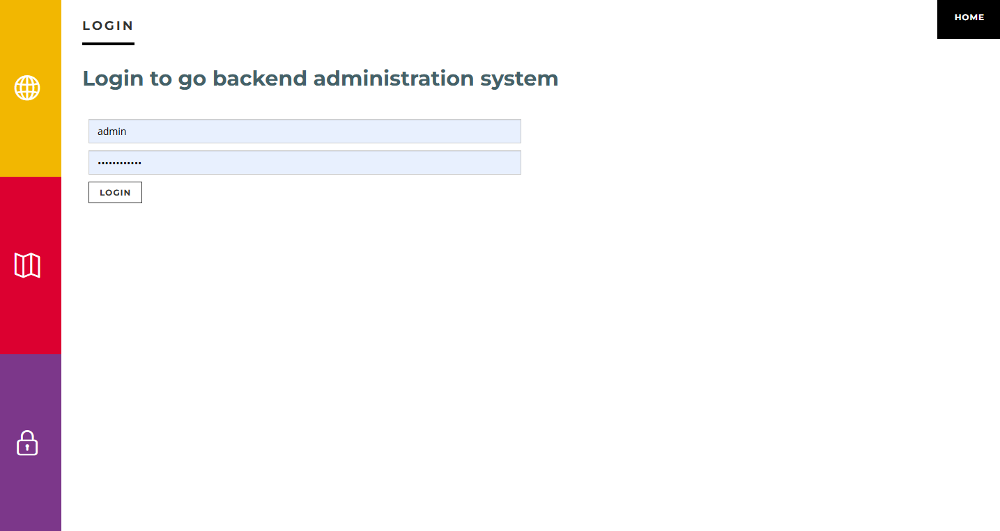
       <div style="font-size: 0.8em; color: gray; margin-top: 4px;">
       Image credit: <a href="https://g3wsuite.it/en/g3w-suite-publish-qgis-projects/" target="_blank">G3W-SUITE</a>
       </div>
      </div>

      <br>

You’ve successfully uploaded your SpatiaLite database to the File Manager and can now proceed with publishing your QGIS project.

---

## Publishing a QGIS Project

Once you have updated the project title (to define a unique WebGIS service ID), and uploaded your SpatiaLite database to the correct folder in the File Manager, you’re ready to publish your QGIS project as a WebGIS service in G3W-SUITE.

---

### Publishing a QGIS Project Overview

Publishing a QGIS project is done through the **Dashboard**, which provides access to:

- Your assigned **Cartographic-** and **Macro Cartographic Groups**
- **Additional module menus** for managing services and settings

<br>

**To publish a project, you’ll need to:**

1. Create a **Cartographic Macro Group**

2. Create a **Cartographic Group**

3. Complete a series of **project form fields**, organized as follows:

<br>

| **Section**            | **Field**           | **Description**                                              |
|------------------------|---------------------| -------------------------------------------------------------|
| **QGIS Project**       | QGIS prioject file  | Upload the `.qgz` or `.qgs` file representing your QGIS project.                                |
| **ACL Users**          | Viewer users        | Select individual users allowed to view the WebGIS. Use `AnonymousUser` to allow public access. |
|                        | Viewer user groups  | Assign user groups that can view the WebGIS content.                                |
| **Default Base Layer** | Base layer          | Choose a default base layer to display at startup (optional, limited to those defined for the group).|
| **Description Data**   | Public title        | Title shown in the WebGIS interface. Falls back to project title or filename if left blank.              |
|                        | Description         | A short description of the project shown in the portal.                                 |
|                        | Thumbnail (Logo)    | Image/logo used to represent the project in the list view.                                   |
|                        | URL alias           | Human-readable URL path for accessing the WebGIS.                                 |

<br>

> **Note:** Fields marked with an asterisk (*) are required.

<br>

In the **Options and Actions** section, you can toggle several key features that influence how the WebGIS service behaves at runtime:

<br>

| **Option**                            | **Description**                                                          |
|---------------------------------------|------------------------------------------------------------------------|
| **Tab's TOC active as default**       | Open the TOC tab (Layers, Base Layers, etc.) by default when the client loads.          |
| **Tab's TOC layer initial status**    | Set whether the layers in the TOC start as collapsed or expanded.        |
| **Map themes list initial status**    | Set whether the map theme list starts as collapsed or expanded.          |
| **Legend position rendering**         | Choose whether the legend appears in a separate tab or within the TOC    panel.          |
| **WMS GetMap image format**           | Specify the preferred image format for WMS GetMap requests.              |
| **Max feature to get for query**      | Set the maximum number of features returned from a query.                |
| **Query control mode**                | Define whether queries allow single or multiple selections.              |
| **Query by bbox control mode**        | Set bounding box queries to single or multiple mode.                     |
| **Query by polygon control mode**     | Set polygon-based queries to single or multiple mode.                    |
| **Geocoding providers**               | Configure which geocoding services are available for address-based searches.       |

<br>

Now that you're familiar with the workflow and the publishing interface key components, let’s apply this knowledge.

---

### Publishing a QGIS Project Exercise

**Creating a Macro Group**

Follow the steps below to create a Macro Cartographic Group in G3W-SUITE:

<br>

1. From the Administration Panel, in the left-side navigation menu, click **Dashboard**.

       <br>

       <div style="text-align: center;">
       
       <div style="font-size: 0.8em; color: gray; margin-top: 4px;">
       Image credit: <a href="https://g3wsuite.it/en/g3w-suite-publish-qgis-projects/" target="_blank">G3W-SUITE</a>
       </div>
       </div>

       <br>

2. Within the Dashboard, locate the light blue **Groups** box.

      <br>

3. Click **Show** to display the list of existing **Cartographic Groups**.

      <br>

      <div style="text-align: center;">
       
       <div style="font-size: 0.8em; color: gray; margin-top: 4px;">
       Image credit: <a href="https://g3wsuite.it/en/g3w-suite-publish-qgis-projects/" target="_blank">G3W-SUITE</a>
       </div>
      </div>

      <br>

4. In the left navigation bar under **Macro Cartographic Groups**, click **Add MACRO Group**

      <br>

      <div style="text-align: center;">
       
       <div style="font-size: 0.8em; color: gray; margin-top: 4px;">
       Image credit: <a href="https://g3wsuite.it/en/g3w-suite-publish-qgis-projects/" target="_blank">G3W-SUITE</a>
       </div>
      </div>

      <br>

5. On the Macro Group creation page, under the **General Data** section, complete the following fields:

      - **Identification name:** `G3W Tutorial Macro Group`
      - **Title:** `G3W Tutorial Macro Group`

      <br>

      <div style="text-align: center;">
       
       <div style="font-size: 0.8em; color: gray; margin-top: 4px;">
       Image credit: <a href="https://g3wsuite.it/en/g3w-suite-publish-qgis-projects/" target="_blank">G3W-SUITE</a>
       </div>
      </div>

      <br>

6. In the **Logo Image** section, upload the `image_macro_group` PNG located in the `Tutorial_Data_G3WSUITE` folder.

      <br>

      <div style="text-align: center;">
       
       <div style="font-size: 0.8em; color: gray; margin-top: 4px;">
       Image credit: <a href="https://g3wsuite.it/en/g3w-suite-publish-qgis-projects/" target="_blank">G3W-SUITE</a>
       , <a href="https://www.vecteezy.com/free-photo/cartography" target="_blank">Vecteezy</a>
       </div>
      </div>

      <br>

7. Once all fields are complete, click **Save** to finalize the creation of your Macro Group.

      <br>

---

**Creating a Group**

Follow the steps below to create a Cartographic Group within G3W-SUITE:

<br>

1. In the left-side navigation bar, under **Cartographic Groups**, click on **Add Group**

      <br>

      <div style="text-align: center;">
       
       <div style="font-size: 0.8em; color: gray; margin-top: 4px;">
       Image credit: <a href="https://g3wsuite.it/en/g3w-suite-publish-qgis-projects/" target="_blank">G3W-SUITE</a>
       </div>
      </div>

      <br>

2. On the Group Creation page, under the **General Data** section, fill out the following fields:

      - **Name:** `G3W Tutorial Group`
      - **Title:** `G3W Tutorial Group`

      <br>

      <div style="text-align: center;">
       
       <div style="font-size: 0.8em; color: gray; margin-top: 4px;">
       Image credit: <a href="https://g3wsuite.it/en/g3w-suite-publish-qgis-projects/" target="_blank">G3W-SUITE</a>
       </div>
      </div>

      <br>

3. In the **MACRO Groups** section, select the previously created group: `G3W Tutorial Macro Group`

      <br>

4. Under **GEO Data**, set the Coordinate Reference System (CRS) to `EPSG 3857`.

      <br>

      > **Hint:** Not sure about your project's CRS? In QGIS, go to **Project → Properties → General** to confirm the EPSG code.

      <br>

      <div style="text-align: center;">
       
       <div style="font-size: 0.8em; color: gray; margin-top: 4px;">
       Image credit: <a href="https://g3wsuite.it/en/g3w-suite-publish-qgis-projects/" target="_blank">G3W-SUITE</a>
       </div>
      </div>

      <br>

5. In the **Base Layers and Map default features** section, select **OSM (OpenStreetMap)** as your baselayer.

      <br>

      <div style="text-align: center;">
       
       <div style="font-size: 0.8em; color: gray; margin-top: 4px;">
       Image credit: <a href="https://g3wsuite.it/en/g3w-suite-publish-qgis-projects/" target="_blank">G3W-SUITE</a>
       </div>
      </div>

      <br>

6. In the **Logo/Picture** section, upload the `image_group` PNG located in the `Tutorial_Data_G3WSUITE` folder.

      <br>

      <div style="text-align: center;">
       
       <div style="font-size: 0.8em; color: gray; margin-top: 4px;">
       Image credit: <a href="https://g3wsuite.it/en/g3w-suite-publish-qgis-projects/" target="_blank">G3W-SUITE</a>
       </div>
      </div>

      <br>

7. Once all details are complete, click the **Save** button to finalize your group setup.

      <br>

---

**Adding a QGIS Project**

1. In the **Cartographic Groups** tab, under `Project Group`, click the **Add New Project** button.

      <br>

      <div style="text-align: center;">
       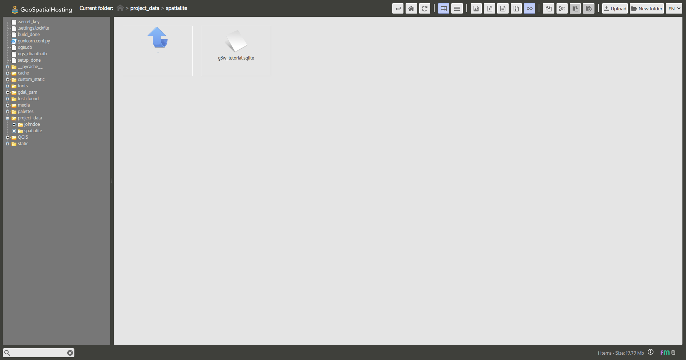
       <div style="font-size: 0.8em; color: gray; margin-top: 4px;">
       Image credit: <a href="https://g3wsuite.it/en/g3w-suite-publish-qgis-projects/" target="_blank">G3W-SUITE</a>
       </div>
      </div>

      <br>

2. The **New QGIS Project** page opens.

      <br>

3. Under the **QGIS Project** section, upload your `.qgz` or `.qgs` file from: `Tutorial_Data_G3WSUITE → projects`

      <br>

      <div style="text-align: center;">
       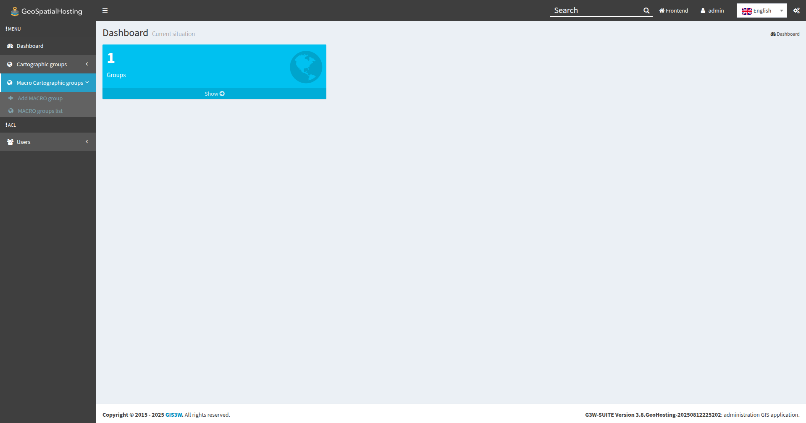
       <div style="font-size: 0.8em; color: gray; margin-top: 4px;">
       Image credit: <a href="https://g3wsuite.it/en/g3w-suite-publish-qgis-projects/" target="_blank">G3W-SUITE</a>
       </div>
      </div>

      <br>

4. Under **Descriptive Data**, complete the following fields:

      - **Public Title:** `G3W Tutorial Project`
      - **Thumbnail:** `image_project`

      <br>

      <div style="text-align: center;">
       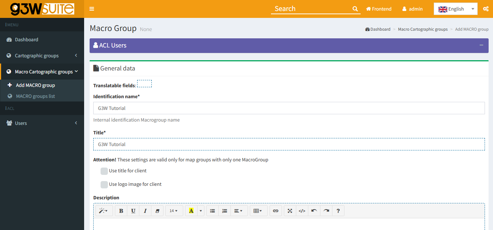
       <div style="font-size: 0.8em; color: gray; margin-top: 4px;">
       Image credit: <a href="https://g3wsuite.it/en/g3w-suite-publish-qgis-projects/" target="_blank">G3W-SUITE</a>
       </div>
      </div>

      <br>

5. Under **Default Base Layer**, choose **OSM (OpenStreetMap)**.

      <br>

      <div style="text-align: center;">
       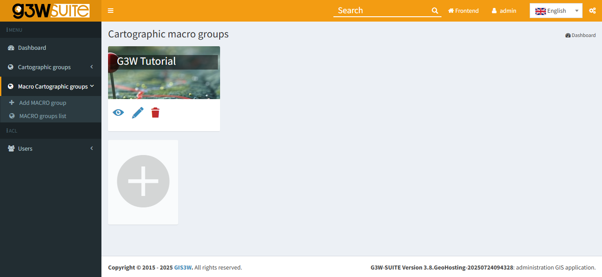
       <div style="font-size: 0.8em; color: gray; margin-top: 4px;">
       Image credit: <a href="https://g3wsuite.it/en/g3w-suite-publish-qgis-projects/" target="_blank">G3W-SUITE</a>
       </div>
      </div>

      <br>

6. In the **Options and Actions** section, leave all settings at their default values.

      <br>

      <div style="text-align: center;">
       
       <div style="font-size: 0.8em; color: gray; margin-top: 4px;">
       Image credit: <a href="https://g3wsuite.it/en/g3w-suite-publish-qgis-projects/" target="_blank">G3W-SUITE</a>
       </div>
      </div>

      <br>

7. Click the **Save** button.

Once successfully published, the project will appear in the **WebGIS services list** under the `G3W Tutorial Group`. You can click the **View Map** icon to launch and explore the live WebGIS.

<br>

<div style="text-align: center;">
  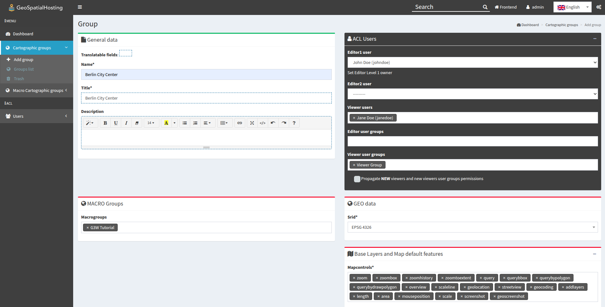
  <div style="font-size: 0.8em; color: gray; margin-top: 4px;">
  Image credit: <a href="https://g3wsuite.it/en/g3w-suite-publish-qgis-projects/" target="_blank">G3W-SUITE</a>
  </div>
</div>

<br>

> **Note:** For more details, refer to the [Publish the QGIS project as a WebGis service](https://g3w-suite.readthedocs.io/en/latest/demo.html#publish-the-qgis-project-as-a-webgis-service) section of the official G3W documentation.

---

## Updating the Published WebGIS Service

You can update both the **graphic** and **functional elements** of an existing WebGIS service in G3W-SUITE.

---

### Updating the Published WebGIS Service Overview

To update a published WebGIS service:

1. **Access the Project List** by navigating to the list of projects under the appropriate Cartographic Group.

2. **Edit the WebGIS Service** by clicking the **Edit** icon next to the desired WebGIS service to upload a modified QGIS file and update configuration options.

<br>

From the WebGIS services list, you can manage a wide range of functionalities using **tools** associated with each project. This allows you to view, modify, and control individual project behavior. Below is a guide to the available **tools and their functionality**:

<br>

<div style="text-align: center;">
  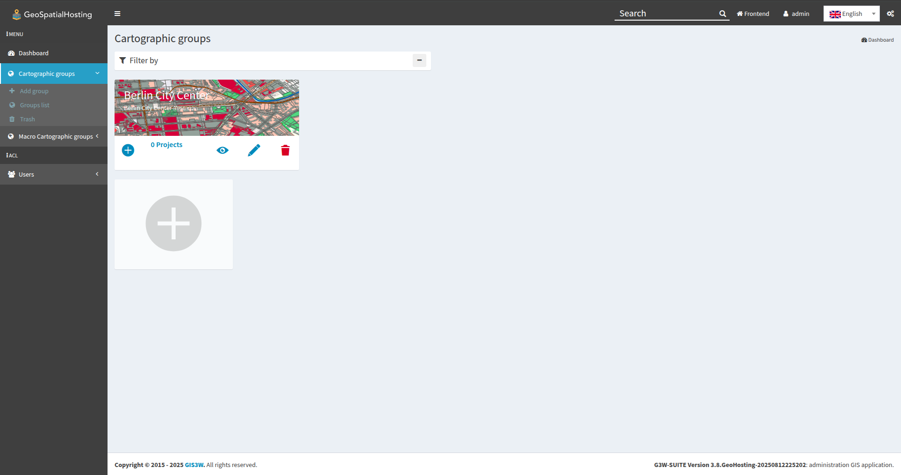
  <div style="font-size: 0.8em; color: gray; margin-top: 4px;">
  Image credit: <a href="https://g3wsuite.it/en/g3w-suite-publish-qgis-projects/" target="_blank">G3W-SUITE</a>
  </div>
</div>

---

### Updating the Published WebGIS Service Exercise

**Setting Up an Overview Map**

You can define a **panoramic overview map** (mini-map) for your WebGIS group. This map appears in a corner of the main WebGIS interface and provides spatial context.

<br>

1. In the **Cartographic Groups** tab, under the `G3W Tutorial Group`, click the **Projects** button.

      <br>

      <div style="text-align: center;">
       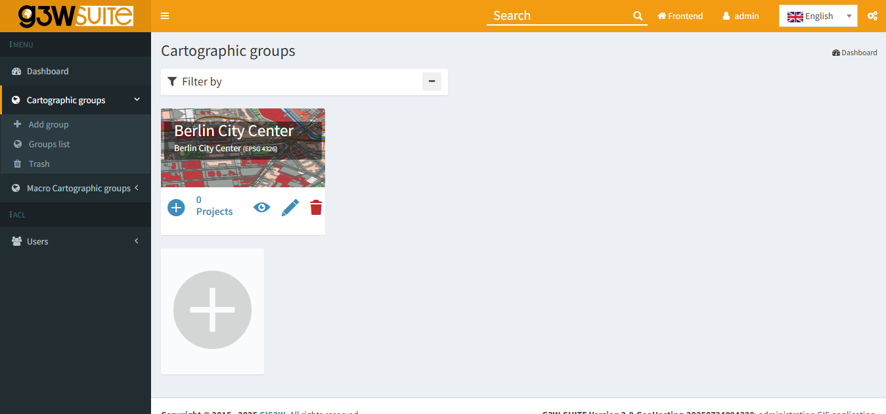
       <div style="font-size: 0.8em; color: gray; margin-top: 4px;">
       Image credit: <a href="https://g3wsuite.it/en/g3w-suite-publish-qgis-projects/" target="_blank">G3W-SUITE</a>
       </div>
      </div>

      <br>

2. Locate the `Tutorial_G3WSUITE` project and check the box in the **Panoramic** column.

      <br>

      <div style="text-align: center;">
       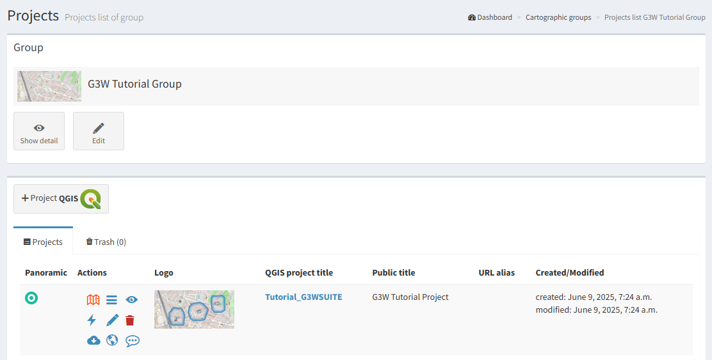
       <div style="font-size: 0.8em; color: gray; margin-top: 4px;">
       Image credit: <a href="https://g3wsuite.it/en/g3w-suite-publish-qgis-projects/" target="_blank">G3W-SUITE</a>
       </div>
      </div>

      <br>

Your updates will now be applied. Use the **View Map** icon from the project list to open the WebGIS to verify the updated configuration, including the newly defined **Overview Map**.

<br>

<div style="text-align: center;">
  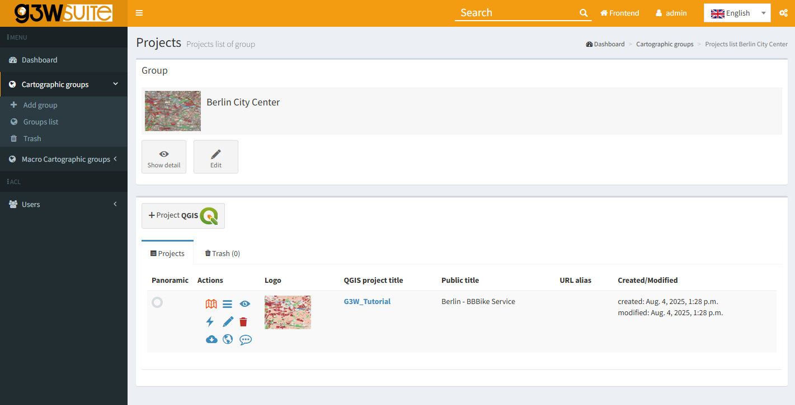
  <div style="font-size: 0.8em; color: gray; margin-top: 4px;">
  Image credit: <a href="https://g3wsuite.it/en/g3w-suite-publish-qgis-projects/" target="_blank">G3W-SUITE</a>
  </div>
</div>

<br>

> **Note:** For more details, refer to the [Update/Manage WebGis services](https://g3w-suite.readthedocs.io/en/latest/g3wsuite_administration.html#update-manage-webgis-services) section of the official G3W documentation.

---

## Activating Additional Functions

Once your project has been published, you can enhance your WebGIS service by enabling a variety of widgets and additional functions.

---

### Activating Additional Functions Overview

By clicking the **Layers** icon you can access the list of **geographic layers** that make up the project. From this interface, you can configure various **functional options** that will be enabled in the cartographic client.

<br>

The **Data** tab contains several columns, including:

| Field            | Description                                                   |
|------------------|---------------------------------------------------------------|
| **Label**        | Alias set in the QGIS project                                 |
| **ID**           | Unique identifier (eye icon) used for parameterized URLs      |
| **Name**         | Layer name (file or DB table)                                 |
| **Type**         | Data source type (WMS, PostGIS, GDAL, etc.)                   |
| **WMS External** | Option to handle GetFeatureInfo responses outside QGIS Server |
| **WFS**          | Indicates if the layer is available as WFS                    |

<br>

> **Note:** WMS layers are handled directly by Django to speed up loading, bypassing QGIS Server.

<br>

Under the **Actions** column next to each layer, you’ll find a series of **icons** that allow you to manage its behavior and visibility:

<br>

<div style="text-align: center;">
  
  <div style="font-size: 0.8em; color: gray; margin-top: 4px;">
  Image credit: <a href="https://g3wsuite.it/en/g3w-suite-publish-qgis-projects/" target="_blank">G3W-SUITE</a>
  </div>
</div>

<br>

> **Hint:** Each action icon displays a number indicating how many related objects are configured.

<br>

The **Download Capabilities** column allows for the download of vector and raster data in the following formats:

| Format      | Available For                  |
|-------------|--------------------------------|
| SHP/GeoTIFF | Vector and raster layers       |
| GPKG        | All layers                     |
| XLS         | All layers                     |
| CSV         | All layers                     |
| GPX         | Geographic layers              |
| PDF         | Attribute-level export for all |

<br>

The **Visibility Capabilities** column allows you to configure general visibility options (applies to all users):

| Option                    | Effect                   |
|---------------------------|--------------------------|
| **Hide Attributes Table** | Disables attribute table |
| **Hide Legend**           | Disables legend display  |
| **Hide Layer TOC**        | Removes layer from TOC   |

<br>

> **Hint:** Try enabling these features and test them directly in your WebGIS interface.

---

### Activating Additional Functions Exercise

**Creating a Search Widget**

By default, search widgets can be configured on individual vector layers using the fields from the associated attribute table. Each search widget is saved by referencing the layer’s unique identifiers.

This design enables reusability: once a search widget is created for a specific layer, it becomes available in any other project where that same layer is used.

<br>

1. From the Project List page, click the **Layers** icon next to the `Tutorial_G3WSUITE` project.

      <br>

      <div style="text-align: center;">
       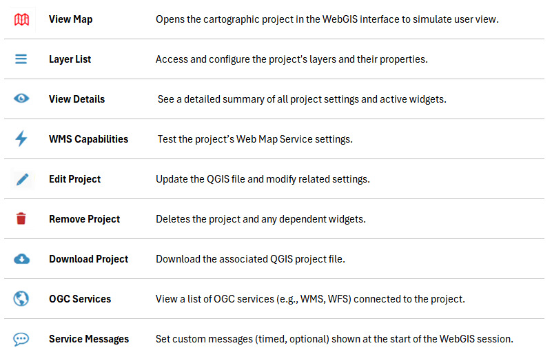
       <div style="font-size: 0.8em; color: gray; margin-top: 4px;">
       Image credit: <a href="https://g3wsuite.it/en/g3w-suite-publish-qgis-projects/" target="_blank">G3W-SUITE</a>
       </div>
      </div>

      <br>

2. The **QGIS Project Layers** section will open displaying **all layers** included in the published QGIS project.

      <br>

      <div style="text-align: center;">
       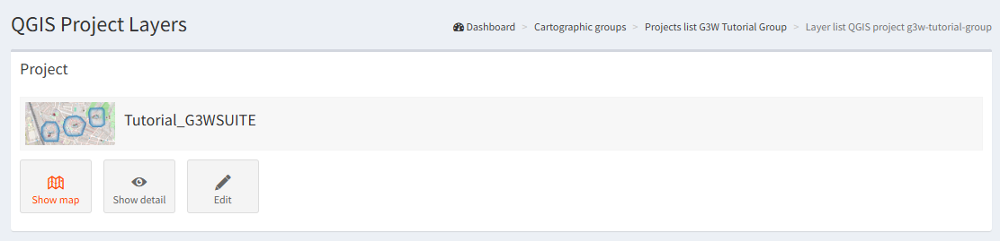
       <div style="font-size: 0.8em; color: gray; margin-top: 4px;">
       Image credit: <a href="https://g3wsuite.it/en/g3w-suite-publish-qgis-projects/" target="_blank">G3W-SUITE</a>
       </div>
      </div>

      <br>

3. Next to the `buildings` layer, click the **Widgets List** icon.

      <br>

4. To create a new widget, click the **Add New Widget** button.

      <br>

      <div style="text-align: center;">
       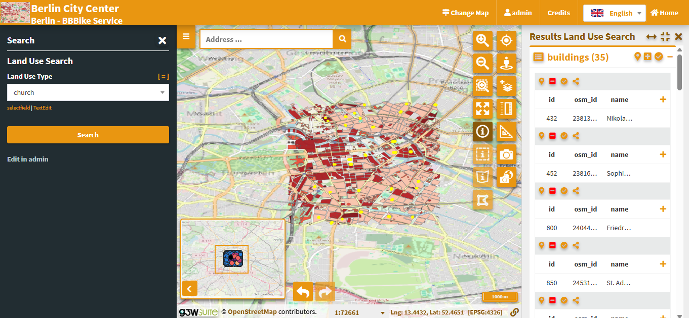
       <div style="font-size: 0.8em; color: gray; margin-top: 4px;">
       Image credit: <a href="https://g3wsuite.it/en/g3w-suite-publish-qgis-projects/" target="_blank">G3W-SUITE</a>
       </div>
      </div>

      <br>

5. In the **Widget Creation Form**, configure the following:

      - **Type:** `Search`
      - **Name:** `Search Widget`
      - **Search Title:** `Tutorial Search Widget`

      <br>

      <div style="text-align: center;">
       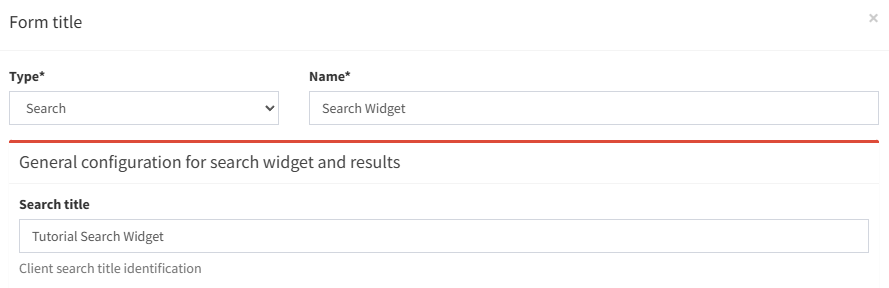
       <div style="font-size: 0.8em; color: gray; margin-top: 4px;">
       Image credit: <a href="https://g3wsuite.it/en/g3w-suite-publish-qgis-projects/" target="_blank">G3W-SUITE</a>
       </div>
      </div>

      <br>

6. In the **Search Field Settings** section, set the following:

      - **Field:** `type`
      - **Widget:** `SelectBox`
      - **Alias:** `Building Type`
      - **Operator:** `= (equal)`

      <br>

      > **Hint:** Use the **Add** button to define multiple search conditions.

      <br>

      <div style="text-align: center;">
       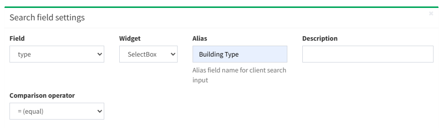
       <div style="font-size: 0.8em; color: gray; margin-top: 4px;">
       Image credit: <a href="https://g3wsuite.it/en/g3w-suite-publish-qgis-projects/" target="_blank">G3W-SUITE</a>
       </div>
      </div>

      <br>

7. Once finished, click **OK** to save.

      <br>

The new search widget will now appear in the layer's widget list and will be automatically available in the WebGIS interface.

<br>

<div style="text-align: center;">
  
  <div style="font-size: 0.8em; color: gray; margin-top: 4px;">
  Image credit: <a href="https://g3wsuite.it/en/g3w-suite-publish-qgis-projects/" target="_blank">G3W-SUITE</a>
  </div>
</div>

---

**Creating a Plots Widget**

The **QPlotly** widget enables users to view interactive plots, created using the **DataPlotly** QGIS plugin (developed by Matteo Ghetta), directly within the WebGIS cartographic client.

This module uses the **Plotly** library and supports plots saved as `.xml` files. Because each plot is linked to a specific layer in the QGIS project, it allows consistent reuse of the same plots across different WebGIS services, as long as the related layer is present.

> **Note:** The plot title, defined in the DataPlotly plugin, acts as the unique identifier.

<br>

Plots can be **filtered** by:

1. **Map Extent:** Based on visible features

2. **Feature Selection:** Based on selected features

<br>

These filters also apply to **related plots** based on **1:N relationships**. As users pan or zoom on the map, all related plots automatically update to reflect the visible extent.

If **selection-based filtering** is enabled, it is automatically applied to all linked plots associated with the same layer. Users will see clear messages on each chart indicating which filters are currently active.

<br>

When a layer has **1:N relationships** with other tables that contain active plots, users can access those plots by querying the parent layer and clicking the **Show Relation Charts** icon. This feature enhances data exploration by allowing users to interact with and analyze related datasets directly within the WebGIS client.

<br>

1. From the **QGIS Project Layers** list, next to the `buildings` layer, click the **Qplotly Widgets** icon.

      <br>

      <div style="text-align: center;">
       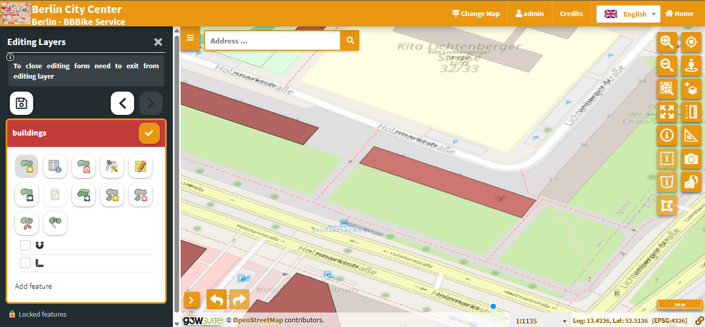
       <div style="font-size: 0.8em; color: gray; margin-top: 4px;">
       Image credit: <a href="https://g3wsuite.it/en/g3w-suite-publish-qgis-projects/" target="_blank">G3W-SUITE</a>
       </div>
      </div>

      <br>

2. To create a new widget, click the **New Qplotly Widget** button.

      <br>

      <div style="text-align: center;">
       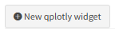
       <div style="font-size: 0.8em; color: gray; margin-top: 4px;">
       Image credit: <a href="https://g3wsuite.it/en/g3w-suite-publish-qgis-projects/" target="_blank">G3W-SUITE</a>
       </div>
      </div>

      <br>

3. In the **New Qplotly Widget** pop-up, click inside the upload box to open your file explorer.

      <br>

4. Navigate to `Tutorial_Data_G3WSUITE -> plots` and select: `qplotly_type-distribution`.

      <br>

5. Click **Ok**.

      <br>

      <div style="text-align: center;">
       
       <div style="font-size: 0.8em; color: gray; margin-top: 4px;">
       Image credit: <a href="https://g3wsuite.it/en/g3w-suite-publish-qgis-projects/" target="_blank">G3W-SUITE</a>
       </div>
      </div>

      <br>

The new chart widget will now appear in the layer's **Qplotly Widget List** and will be automatically available in the WebGIS interface.

<br>

<div style="text-align: center;">
  
  <div style="font-size: 0.8em; color: gray; margin-top: 4px;">
  Image credit: <a href="https://g3wsuite.it/en/g3w-suite-publish-qgis-projects/" target="_blank">G3W-SUITE</a>
  </div>
</div>

<br>

> **Note:** For more details, refer to the [Widgets management](https://g3w-suite.readthedocs.io/en/latest/g3wsuite_administration.html#widgets-management) section of the official G3W documentation.

---

## Editing Online

Forms and editing widgets have already been configured in the tutorial project for both the `buildings` geometric layer and the related `interventions_maintenance` attribute table.

---

### Editing Online Overview

Editing settings are defined partly in the **QGIS project** (e.g. form layout), and partly through the G3W-SUITE **Administration panel** (e.g. user permissions). The editing module supports direct edits on both geometric and attribute-only layers, as well as layers in 1:N or N:M (limited) relationships.

<br>

> **Hint:** In QGIS, the form layout and widgets for each layer’s attributes are configured under: `Layer Properties` → `Attributes Form`.

<br>

G3W-SUITE supports **multi-user editing** through a **feature locking** system.

When a user activates editing in the WebGIS interface, all features visible in the current map view become **locked** to that user. Other users will be restricted from editing these features until the original user exits editing mode.

<br>

> **Note:** Multi-user editing should **only** be enabled on layers stored in a **GeoDatabase** — not on file-based layers (e.g. shapefiles).

---

### Editing Online Exercise

**Activating Editing on a WebGIS Layer**

1. In the **QGIS Project Layers** list, locate the `buildings` layer and click the **Editing Layer** icon.

      <br>

      <div style="text-align: center;">
       
       <div style="font-size: 0.8em; color: gray; margin-top: 4px;">
       Image credit: <a href="https://g3wsuite.it/en/g3w-suite-publish-qgis-projects/" target="_blank">G3W-SUITE</a>
       </div>
      </div>

      <br>

2. In the **Activation layer_editing** dialog, you can:

      - Enable or disable editing capabilities
      - Set the minimum scale for editing
      - Define which user groups are permitted to edit this layer

      <br>

3. Under **Check on uncheck to active/deactive editing layer capabilities**, check the corresponding checkbox.

      <br>

4. Fill in the following fields:

      - **Scale:** `2500`
      - **User Groups Editing Data Field:** `user`

      <br>

      <div style="text-align: center;">
       
       <div style="font-size: 0.8em; color: gray; margin-top: 4px;">
       Image credit: <a href="https://g3wsuite.it/en/g3w-suite-publish-qgis-projects/" target="_blank">G3W-SUITE</a>
       </div>
      </div>

      <br>

5. Click **OK**

      <br>

Once editing is enabled, a new **Editing Layers** menu becomes available in the WebGIS side panel.

<br>

<div style="text-align: center;">
  
  <div style="font-size: 0.8em; color: gray; margin-top: 4px;">
  Image credit: <a href="https://g3wsuite.it/en/g3w-suite-publish-qgis-projects/" target="_blank">G3W-SUITE</a>
  </div>
</div>

---

**Editing a WebGIS**

Once activated, editing allows modifications to both geometry and attributes of the buildings layer and its related interventions.

<br>

1. In the **QGIS Project Layers** list, click **Show Map**.

      <br>

2. In the left-hand panel, click **Editing Layers**

      <br>

3. Click the **Edit Layer** icon next to the `Buildings` layer.

      <br>

      <div style="text-align: center;">
       
       <div style="font-size: 0.8em; color: gray; margin-top: 4px;">
       Image credit: <a href="https://g3wsuite.it/en/g3w-suite-publish-qgis-projects/" target="_blank">G3W-SUITE</a>
       </div>
      </div>

      <br>

4. Zoom into an open area where no buildings exist.

      <br>

      <div style="text-align: center;">
       
       <div style="font-size: 0.8em; color: gray; margin-top: 4px;">
       Image credit: <a href="https://g3wsuite.it/en/g3w-suite-publish-qgis-projects/" target="_blank">G3W-SUITE</a>
       </div>
      </div>

      <br>

5. In the left-hand panel, click the **Add Feature** button.

      <br>

      <div style="text-align: center;">
       
       <div style="font-size: 0.8em; color: gray; margin-top: 4px;">
       Image credit: <a href="https://g3wsuite.it/en/g3w-suite-publish-qgis-projects/" target="_blank">G3W-SUITE</a>
       </div>
      </div>

      <br>

6. Draw a continuous shape on the basemap. Once finished, the **Editing Attributes** panel will opens.

      <br>

      <div style="text-align: center;">
       
       <div style="font-size: 0.8em; color: gray; margin-top: 4px;">
       Image credit: <a href="https://g3wsuite.it/en/g3w-suite-publish-qgis-projects/" target="_blank">G3W-SUITE</a>
       </div>
      </div>

      <br>

7. Under the **General Info** tab, fill in:

      - `Name`
      - `Type`

      <br>

8. Under the **Technical Data** tab, fill in:

      - `Year of Construction`
      - `High`

      <br>

9. At the bottom of the form, click **Insert/Edit**

      <br>

10. In the left-hand panel, click the **Save** or **Checkmark** icon.

      <br>

      <div style="text-align: center;">
       
       <div style="font-size: 0.8em; color: gray; margin-top: 4px;">
       Image credit: <a href="https://g3wsuite.it/en/g3w-suite-publish-qgis-projects/" target="_blank">G3W-SUITE</a>
       </div>
      </div>

      <br>

Your new `Buildings` feature is now saved to the WebGIS.

<br>

<div style="text-align: center;">
  
  <div style="font-size: 0.8em; color: gray; margin-top: 4px;">
  Image credit: <a href="https://g3wsuite.it/en/g3w-suite-publish-qgis-projects/" target="_blank">G3W-SUITE</a>
  </div>
</div>

<br>

> **Note:** For more details, refer to the [Editing on line](https://g3w-suite.readthedocs.io/en/latest/g3wsuite_editing.html#editing-on-line) section of the official G3W documentation.
