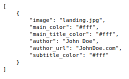
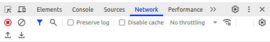
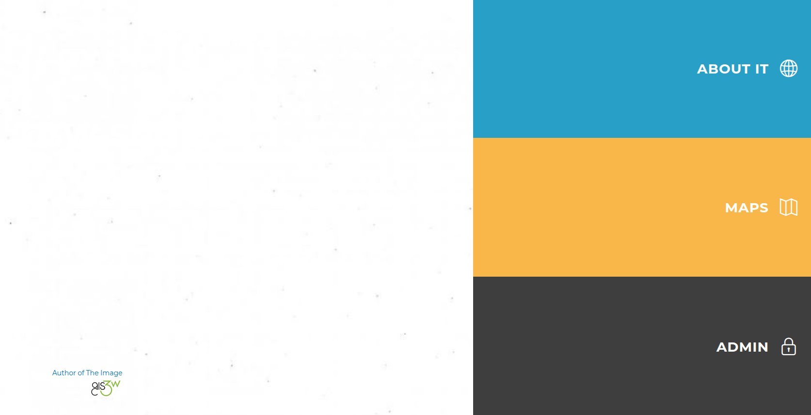
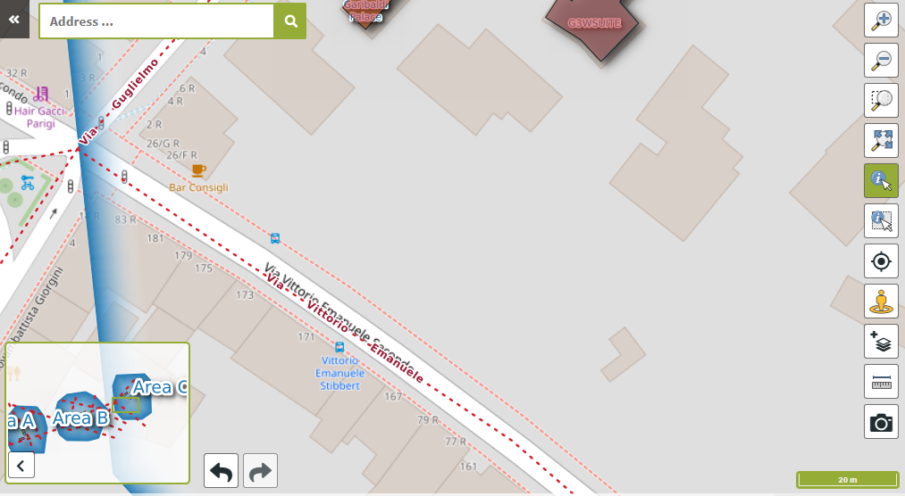
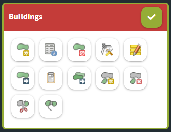
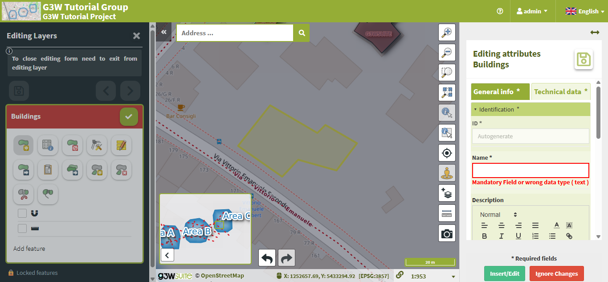

# Editing Online

Forms and editing widgets have already been configured in the tutorial project for both the `buildings` geometric layer and the related `interventions_maintenance` attribute table.

 

Editing settings are defined partly in the **QGIS project** (e.g. form layout), and partly through the G3W-SUITE **Administration panel** (e.g. user permissions). The editing module supports direct edits on both geometric and attribute-only layers, as well as layers in 1:N or N:M (limited) relationships.

 

> **Hint:** In QGIS, the form layout and widgets for each layer’s attributes are configured under: `Layer Properties` → `Attributes Form`.

 

G3W-SUITE supports **multi-user editing** through a **feature locking** system.

When a user activates editing in the WebGIS interface, all features visible in the current map view become **locked** to that user. Other users will be restricted from editing these features until the original user exits editing mode.

 

> **Note:** Multi-user editing should **only** be enabled on layers stored in a **GeoDatabase** — not on file-based layers (e.g. shapefiles).

---

## Exercise

**Activating Editing on a WebGIS Layer**

1. In the **QGIS Project Layers** list, locate the `buildings` layer and click the **Editing Layer** icon.

       

      

       
       

       Image credit: <a href="https://g3wsuite.it/en/g3w-suite-publish-qgis-projects/" target="_blank">G3W-SUITE</a>
       

      

       

2. In the **Activation layer_editing** dialog, you can:

      - Enable or disable editing capabilities
      - Set the minimum scale for editing
      - Define which user groups are permitted to edit this layer

       

3. Under **Check on uncheck to active/deactive editing layer capabilities**, check the corresponding checkbox.

       

4. Fill in the following fields:

      - **Scale:** `2500`
      - **User Groups Editing Data Field:** `user`

       

      

       
       

       Image credit: <a href="https://g3wsuite.it/en/g3w-suite-publish-qgis-projects/" target="_blank">G3W-SUITE</a>
       

      

       

5. Click **OK**

       

Once editing is enabled, a new **Editing Layers** menu becomes available in the WebGIS side panel.

 

  
  

  Image credit: <a href="https://g3wsuite.it/en/g3w-suite-publish-qgis-projects/" target="_blank">G3W-SUITE</a>
  

---

**Editing a WebGIS**

Once activated, editing allows modifications to both geometry and attributes of the buildings layer and its related interventions.

 

1. In the **QGIS Project Layers** list, click **Show Map**.

       

2. In the left-hand panel, click **Editing Layers**

       

3. Click the **Edit Layer** icon next to the `Buildings` layer.

       

      

       
       

       Image credit: <a href="https://g3wsuite.it/en/g3w-suite-publish-qgis-projects/" target="_blank">G3W-SUITE</a>
       

      

       

4. Zoom into an open area where no buildings exist.

       

      

       
       

       Image credit: <a href="https://g3wsuite.it/en/g3w-suite-publish-qgis-projects/" target="_blank">G3W-SUITE</a>
       

      

       

5. In the left-hand panel, click the **Add Feature** button.

       

      

       
       

       Image credit: <a href="https://g3wsuite.it/en/g3w-suite-publish-qgis-projects/" target="_blank">G3W-SUITE</a>
       

      

       

6. Draw a continuous shape on the basemap. Once finished, the **Editing Attributes** panel will opens.

       

      

       
       

       Image credit: <a href="https://g3wsuite.it/en/g3w-suite-publish-qgis-projects/" target="_blank">G3W-SUITE</a>
       

      

       

7. Under the **General Info** tab, fill in:

      - `Name`
      - `Type`

       

8. Under the **Technical Data** tab, fill in:

      - `Year of Construction`
      - `High`

       

9. At the bottom of the form, click **Insert/Edit**

       

10. In the left-hand panel, click the **Save** or **Checkmark** icon.

       

      

       
       

       Image credit: <a href="https://g3wsuite.it/en/g3w-suite-publish-qgis-projects/" target="_blank">G3W-SUITE</a>
       

      

       

Your new `Buildings` feature is now saved to the WebGIS.

 

  
  

  Image credit: <a href="https://g3wsuite.it/en/g3w-suite-publish-qgis-projects/" target="_blank">G3W-SUITE</a>
  

 

> **Note:** For more details, refer to the [Editing on line](https://g3w-suite.readthedocs.io/en/latest/g3wsuite_editing.html#editing-on-line) section of the official G3W documentation.
