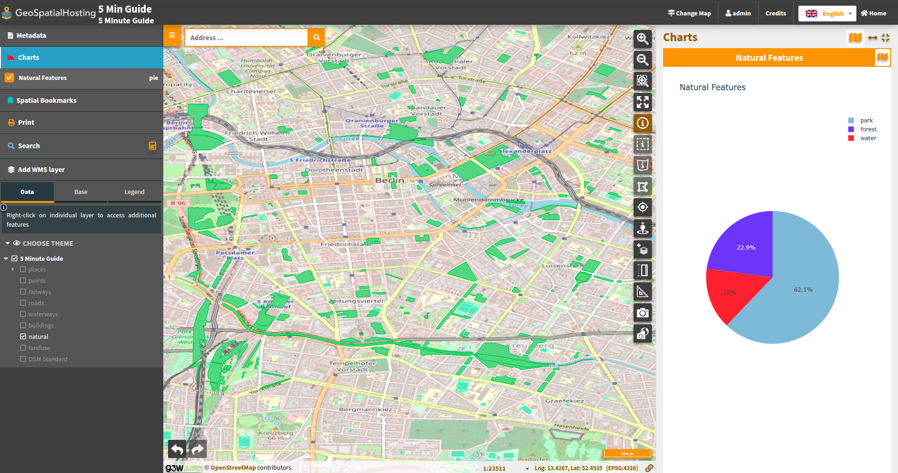
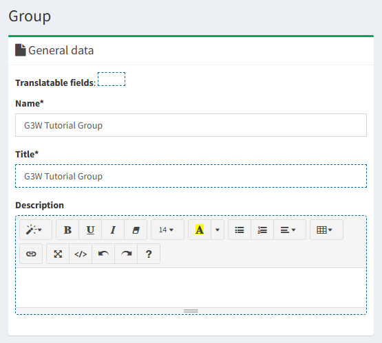
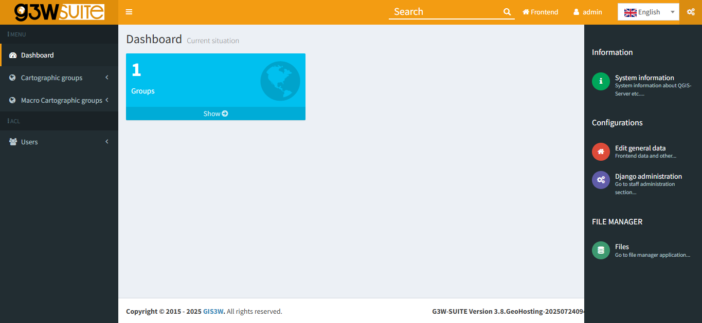
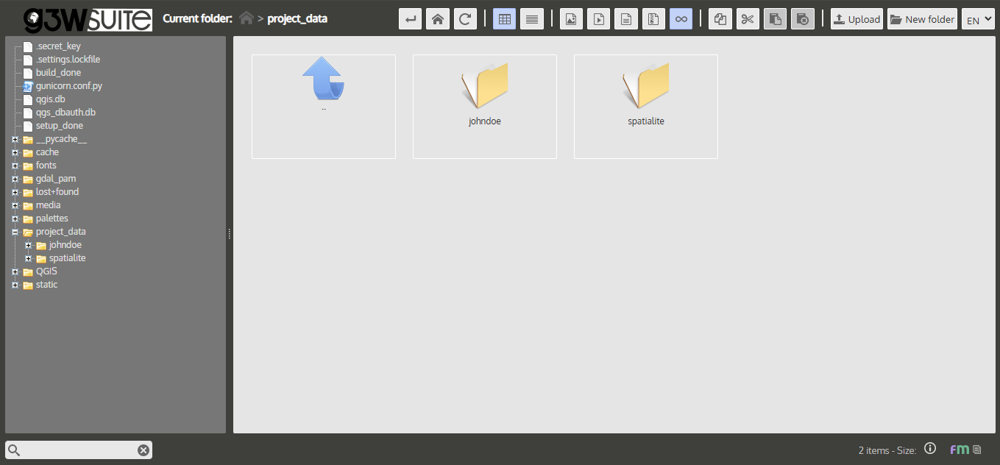

# Group

## Creating a Group

Follow the steps below to create a Cartographic Group within G3W-SUITE:

 

1. In the left-side navigation bar, under **Cartographic Groups**, click on **Add Group**

       

      

       
       

       Image credit: <a href="https://g3wsuite.it/en/g3w-suite-publish-qgis-projects/" target="_blank">G3W-SUITE</a>
       

      

       

2. On the Group Creation page, under the **General Data** section, fill out the following fields:

      - **Name:** `G3W Tutorial Group`
      - **Title:** `G3W Tutorial Group`

       

      

       
       

       Image credit: <a href="https://g3wsuite.it/en/g3w-suite-publish-qgis-projects/" target="_blank">G3W-SUITE</a>
       

      

       

3. In the **MACRO Groups** section, select the previously created group: `G3W Tutorial Macro Group`

       

4. Under **GEO Data**, set the Coordinate Reference System (CRS) to `EPSG 3857`.

       

      > **Hint:** Not sure about your project's CRS? In QGIS, go to **Project → Properties → General** to confirm the EPSG code.

       

      

       
       

       Image credit: <a href="https://g3wsuite.it/en/g3w-suite-publish-qgis-projects/" target="_blank">G3W-SUITE</a>
       

      

       

5. In the **Base Layers and Map default features** section, select **OSM (OpenStreetMap)** as your baselayer.

       

      

       
       

       Image credit: <a href="https://g3wsuite.it/en/g3w-suite-publish-qgis-projects/" target="_blank">G3W-SUITE</a>
       

      

       

6. In the **Logo/Picture** section, upload the `image_group` PNG located in the `Tutorial_Data_G3WSUITE` folder.

       

      

       
       

       Image credit: <a href="https://g3wsuite.it/en/g3w-suite-publish-qgis-projects/" target="_blank">G3W-SUITE</a>
       

      

       

7. Once all details are complete, click the **Save** button to finalize your group setup.
