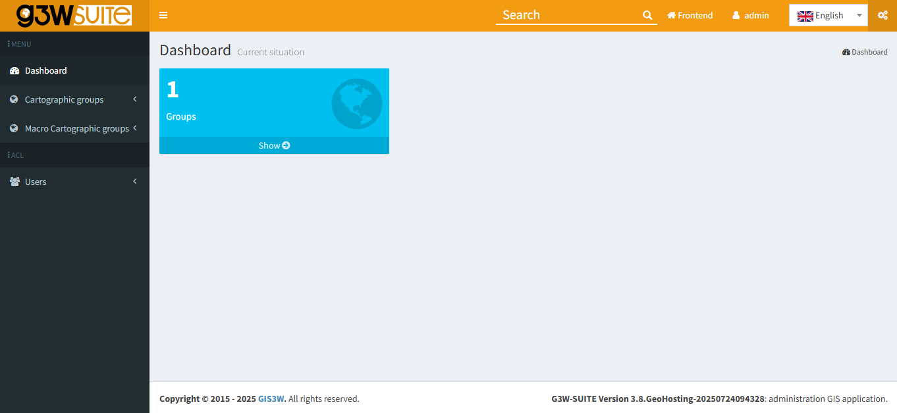
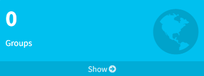
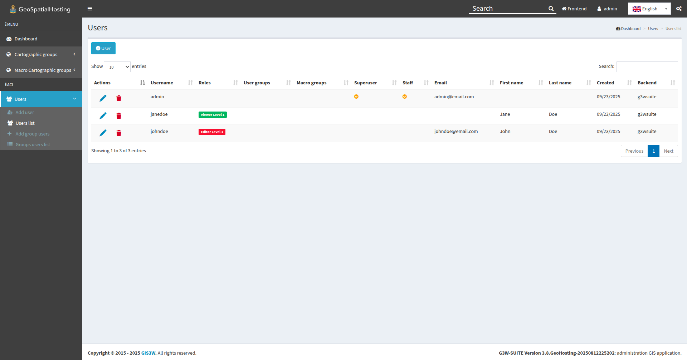
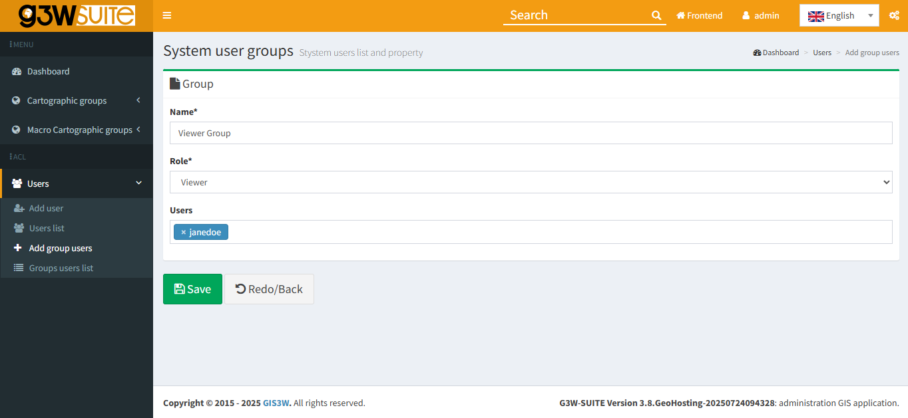
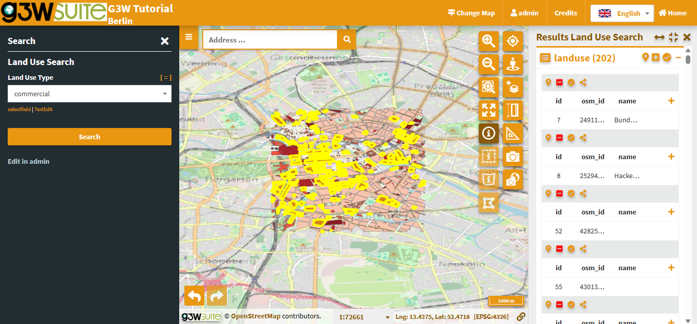

# Macro Group

## Overview

Once you have updated the project title (to define a unique WebGIS service ID), and uploaded your SpatiaLite database to the correct folder in the File Manager, you’re ready to publish your QGIS project as a WebGIS service in G3W-SUITE.

 

Publishing a QGIS project is done through the **Dashboard**, which provides access to:

- Your assigned **Cartographic-** and **Macro Cartographic Groups**
- **Additional module menus** for managing services and settings

 

**To publish a project, you’ll need to:**

1. Create a **Cartographic Macro Group**

2. Create a **Cartographic Group**

3. Complete a series of **project form fields**

 

## Creating a Macro Group

Follow the steps below to create a Macro Cartographic Group in G3W-SUITE:

 

1. From the Administration Panel, in the left-side navigation menu, click **Dashboard**.

        

       

       
       

       Image credit: <a href="https://g3wsuite.it/en/g3w-suite-publish-qgis-projects/" target="_blank">G3W-SUITE</a>
       

       

        

2. Within the Dashboard, locate the light blue **Groups** box.

       

3. Click **Show** to display the list of existing **Cartographic Groups**.

       

      

       
       

       Image credit: <a href="https://g3wsuite.it/en/g3w-suite-publish-qgis-projects/" target="_blank">G3W-SUITE</a>
       

      

       

4. In the left navigation bar under **Macro Cartographic Groups**, click **Add MACRO Group**

       

      

       
       

       Image credit: <a href="https://g3wsuite.it/en/g3w-suite-publish-qgis-projects/" target="_blank">G3W-SUITE</a>
       

      

       

5. On the Macro Group creation page, under the **General Data** section, complete the following fields:

      - **Identification name:** `G3W Tutorial Macro Group`
      - **Title:** `G3W Tutorial Macro Group`

       

      

       
       

       Image credit: <a href="https://g3wsuite.it/en/g3w-suite-publish-qgis-projects/" target="_blank">G3W-SUITE</a>
       

      

       

6. In the **Logo Image** section, upload the `image_macro_group` PNG located in the `Tutorial_Data_G3WSUITE` folder.

       

      

       
       

       Image credit: <a href="https://g3wsuite.it/en/g3w-suite-publish-qgis-projects/" target="_blank">G3W-SUITE</a>
       , <a href="https://www.vecteezy.com/free-photo/cartography" target="_blank">Vecteezy</a>
       

      

       

7. Once all fields are complete, click **Save** to finalize the creation of your Macro Group.
