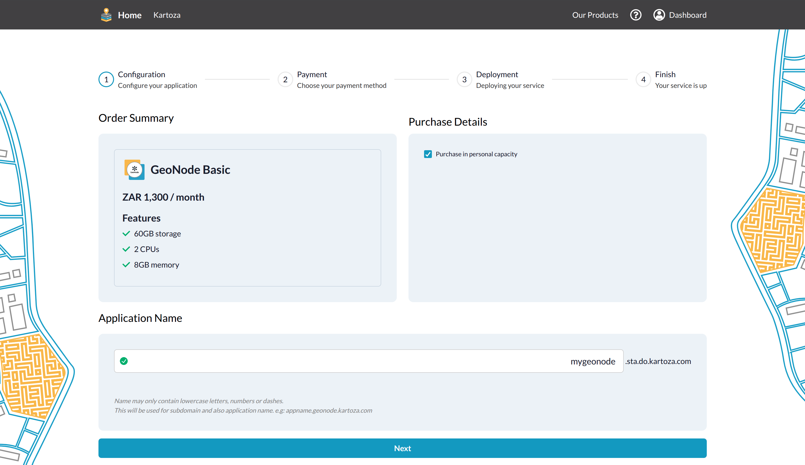
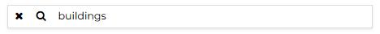

# Navigating the Dashboard

## Home Page Layout

When you log in, GeoNode opens on the **Home Page**. The layout features:

- **Top Navigation Bar** – quick access to Datasets, Maps, Documents, Search, and your user menu.
- **Resource Tiles** – showcase the most recent or featured items.
- **Search Box** – global, full-text search across all resource types.

 

  
  

    Image credit: <a href="https://geonode.org/" target="_blank">GeoNode</a>
  

 

## Top Navigation Bar

| Button | Purpose |
| ------ | ------- |
| **Datasets** | Browse, upload, or manage spatial datasets. |
| **Maps** | Create new maps or view existing ones. |
| **Documents** | Upload and manage supporting documents. |
| **Search Box** | Enter any keyword to jump straight to the Search page. |
| **Avatar Menu** | Access Profile, Admin (if permitted), and Logout. |

## Quick Search

Type any text in the top-bar **Search Box** and press **Enter** to see results across all resource types.

 

  
  

    Image credit: <a href="https://geonode.org/" target="_blank">GeoNode</a>
  

 

## Search Page Filters

On the Search page you can refine results using:

- **Resource Types** (datasets, maps, documents…)
- **Categories, Keywords, Owners, Groups**
- **Date range**
- **Spatial Extent** (drag a bounding box on the mini-map)

 

  
  

    Image credit: <a href="https://geonode.org/" target="_blank">GeoNode</a>
  

 

You can sort results by **Most Recent**, **Name**, or **Popularity** using the sort dropdown at the top right.

## All Resources Page

Selecting any tab (Datasets, Maps, Documents) brings you to its **All Resources** view. Each entry has:

- **Thumbnail** preview
- **Resource title** and owner
- **View** button (opens detail page)
- **More ⋮** menu for actions (Edit, Share, Delete – depending on permissions)

 

  
  

    Image credit: <a href="https://geonode.org/" target="_blank">GeoNode</a>
  

 

## Resource Detail Pages

Click **View** on any item to open its detail page, where you can:

- Inspect metadata
- Preview the map or document
- Download (if allowed)
- Rate or comment
- Access **Resource → Share** to adjust permissions

Mastering these navigation tools lets you quickly locate, preview, and manage all content in your GeoNode portal.
