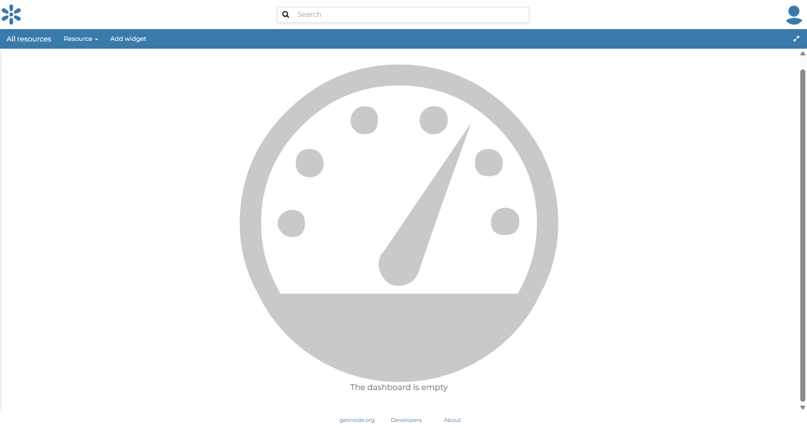
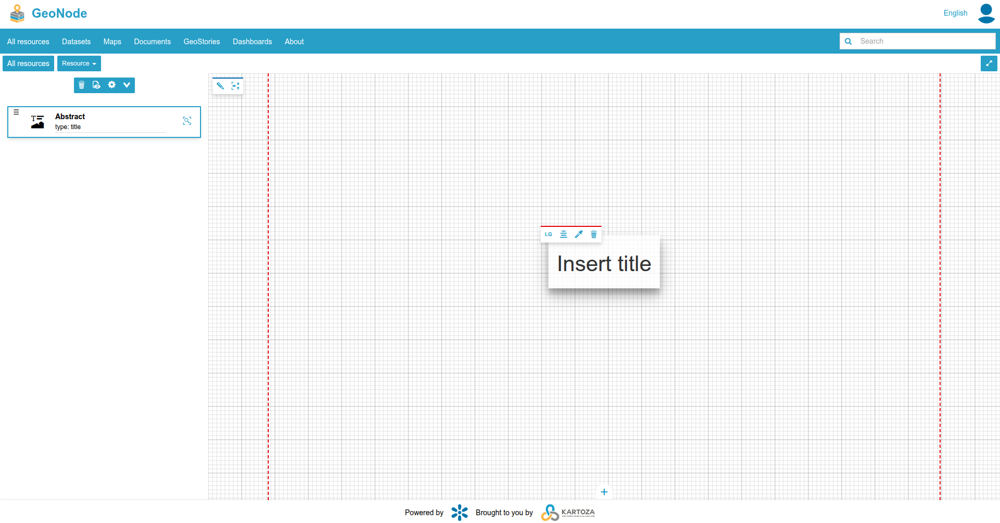

## Integrating With Other Tools

GeoNode exposes all datasets through standard **OGC** services, so you can easily consume layers in desktop GIS software or embed them in web maps.

---

### Consuming GeoNode WMS in QGIS

1. **Open QGIS** and choose **Layer → Add Layer → Add WMS/WMTS Layer…**  
2. Click **New**, then enter:  
   *Name*: `GeoNode WMS`  
   *URL*:  
   ```
   http://<geonode_application_name>.sta.do.kartoza.com/geoserver/ows?service=WMS&version=1.3.0&request=GetCapabilities
   ```  
3. Click **OK**, then **Connect**.  
4. Select the layer you want (e.g. `tutorial:buildings`) and click **Add**.  
5. The layer appears in the QGIS map canvas.

  
*Image credit: User’s GeoNode instance*

---

### Embedding a GeoNode Layer in Leaflet

1. Include Leaflet’s CSS and JS in your HTML **`<head>`**:  
   ```html
   <link rel="stylesheet" href="https://unpkg.com/leaflet/dist/leaflet.css"/>
   <script src="https://unpkg.com/leaflet/dist/leaflet.js"></script>
   ```
2. In your **`<body>`**, add a map container:  
   ```html
   <div id="map" style="height: 400px;"></div>
   ```
3. Initialise the map and add the WMS layer:  
   ```html
   <script>
     const map = L.map('map').setView([52.51, 13.40], 12); // Berlin centre
     L.tileLayer.wms('http://<geonode_application_name>.sta.do.kartoza.com/geoserver/ows', {
       layers: 'tutorial:buildings',
       format: 'image/png',
       transparent: true,
       attribution: '© GeoNode'
     }).addTo(map);
   </script>
   ```
4. Open the HTML file in a browser to see the GeoNode layer displayed via Leaflet.

  
*Image credit: User’s web application*

---

### Accessing GeoNode WFS

To retrieve raw feature data (GeoJSON, GML) use **WFS**:

```
http://<geonode_application_name>.sta.do.kartoza.com/geoserver/ows?service=WFS&version=2.0.0&request=GetFeature&typeName=tutorial:buildings&outputFormat=application/json
```

Paste this endpoint into tools such as **curl**, **Postman**, or any web-mapping library that supports WFS.

---

GeoNode’s standards-compliant services make it straightforward to integrate with any desktop GIS, web-mapping framework, or data-analysis pipeline that speaks **WMS, WFS,** or **WCS**.
