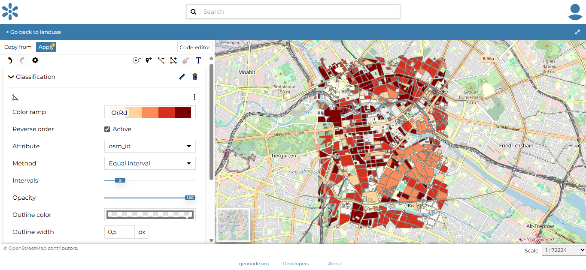
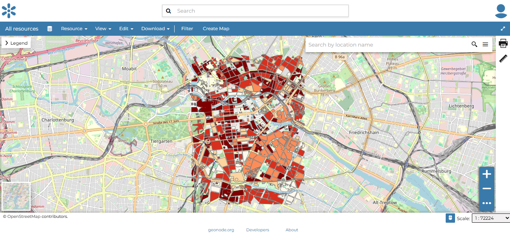

# Managing Users & Permissions

GeoNode uses a role-based permission system.  Each **resource** (dataset, map, document, etc.) can be shared with:

- **Anyone** (public)
- **Registered Members** (all logged-in users)
- **Specific users or groups**

Four permission levels are available:

| Level   | What it Allows                                                                 |
| ------- | ------------------------------------------------------------------------------ |
| **View**   | View metadata and preview the resource.                                      |
| **Download** | View **and** download the file / layer.                                    |
| **Edit**   | Modify metadata, styles, and attributes (datasets) or map settings (maps).   |
| **Manage** | Full control: update, delete, change share options, publish/unpublish.       |

> **Tip:** Documents have “None” (invisible) instead of “View” as their lowest level.

## Opening the Share Panel

1. Navigate to the resource’s **detail page** and click **Resource → Share** in the top toolbar.

 

  
  

    Image credit: <a href="https://geonode.org/" target="_blank">GeoNode</a>
  

 

## Setting Permissions

1. In **Share with people and groups**, choose the role for **Anyone** (public) and **Registered Members**.
2. Use the **Add people or groups** box to grant specific roles to individual users or groups.

 

  
  

    Image credit: <a href="https://geonode.org/" target="_blank">GeoNode</a>
  

 

| Example Setting | Result |
| --------------- | ------ |
| **Anyone → View** **Registered Members → View** | Resource is publicly viewable; downloads require direct link or higher role. |
| **Anyone → None** **Registered Members → View** | Resource is hidden from the public but visible to logged-in users. |
| **Specific Group → Manage** | Only members of that group can edit, delete, or republish the resource. |

## Saving Changes

Click **Resources → Save** to apply the new permissions.

 

  
  

    Image credit: <a href="https://geonode.org/" target="_blank">GeoNode</a>
  

 

> **Note:** Administrators can also manage users and groups globally via **/admin** → *People* and *Groups*, but day-to-day sharing is usually handled through each resource’s Share panel.

Mastering these controls lets you publish data widely while protecting sensitive layers and documents.
