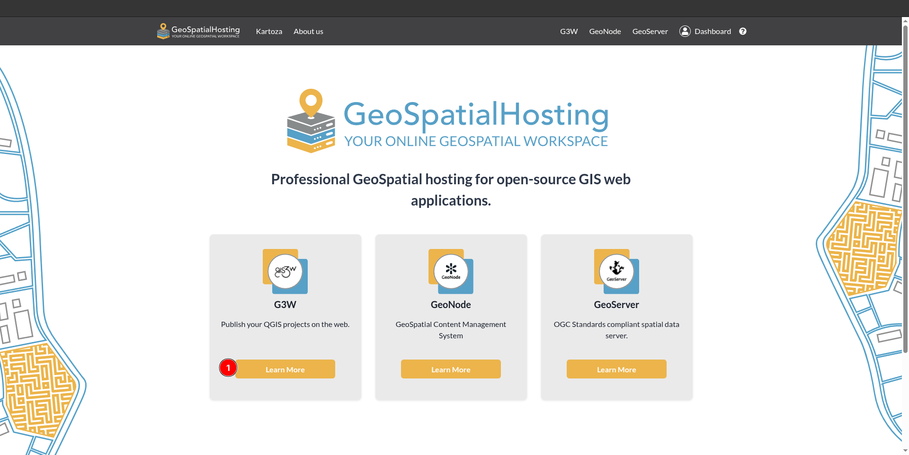
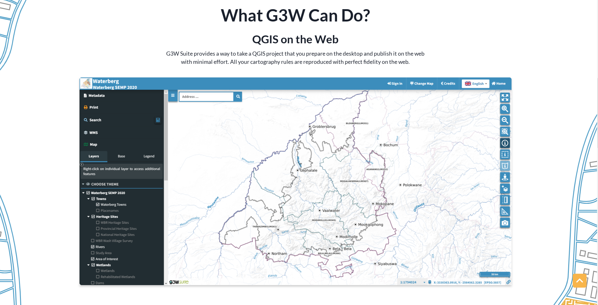

# Subscription

For the subscription users are required to go to the home page.

1. **Learn More:** Users can click on this button to learn more about the platform. This button will redirects the users to the subscription page of the respective platform.

Alternatively, users can click on the platform's name from the top navigation bar, which will also redirect them to the subscription page of the respective platform.

## Types of subscriptions

After reaching the subscription page, users will see the following options:

> Note: Features of the package may vary based on the platform.

### Basic

This is the entry level package of the platform. It includes the base monthly price of the package in our case which is `US$60/month`, which provides 50GB of storage, 2 cpus and 4gb of ram.

### Advanced 

This is the standard package of the platform. It includes the base monthly price of the package in our case which is `US$110/month`, which provides 100GB of storage, 4 cpus and 8gb of ram.

### Gold

This is the standard package of the platform. It includes the base monthly price of the package in our case which is `US$225/month`, which provides 500GB of storage, 8 cpus and 16gb of ram.

## Subscribe to the platform

1. **Get G3W:** Click on this get option of the respective package to get the package. This will redirects the users to the configuration page.

1. **Configuration:** This is the current step we are on. Users can determine their current step by checking which step number has a blue circle around it. Here, users can see all the details of the package they have selected and also choose their application name and company.

2. **Order Summary:** Order summary contains the information about the selected package.

3. **Application name:** Users can change their application name according to their preference. The default name is the name of their company.

4. **Purchase application for:** Users can select a company for purchase. They can also click on the `Create Company` button to add a new company or check the ✅ `Purchase in personal capacity` option. If this option is enabled, users will not be able to select a company.

  * Click [here](./dashboard/profile/edit.md#create-company) to see how to create company.

5. **Next:** After confirming the configurations , users can click on the `Next` button to proceed to the next page.

1. **Payment:** This is the current step we are on.

2. **Order Summary:** Order summary contains the information about the selected package and application name.

3. **Payment Method:** Users can click the `Pay with Stripe` button to proceed with the payment. After clicking on this a form will appear.

This is the agreement of the platform which users have to agree to before proceeding with the payment. Scroll down to the bottom and users will find the form.

1. **Hosting Provider:** In our case there are 2 service providers. Users can select one of them by checking the corresponding `checkbox`. 

2. **Signature:** To sign the agreement, users must double-click on the signature box and draw their signature.

3. **Clear:** Users can clear the signature box by clicking on the `Clear` button.

4. **Decline:** Users can decline the agreement by clicking on the `Decline` button.

5. **Accept:** Users can accept the agreement by clicking on the `Accept` button. This will redirects the users to the payment page.

1. **Pay with link:** Users can pay with a link by clicking on the `Pay with link` button.

2. **Email:** This is the email address associated with the users profile.

3. **Card information:** Users are required to enter their card details including card number, expiration date, and CVC.

4. **Cardholder name:** Users are required to enter the name of the cardholder.

5. **Country:** Users are required to select their country from the dropdown menu.

6. **Phone number:** Users can also provide their phone number, however, it is optional.

7. **Subscribe:** Click here after filling in all the details. After clicking on this button, the payment will be processed and users will be redirected to the hosted service page. After successfully purchasing the service, users will be notified via email.

1. **Product URL:** USers can click on this url to access their hosting. This is how it looks:

    

2. **Access instance detail:** Users can click on this link to check their instance details. This link will redirects them to the hosted service page in the dashboard.

    

    **1. URL:** By clicking on this users will be redirected to their hosting service.

    **2. Get credentials:** By clicking on this users can copy their credentials.

      

* Users can view all the relevant information about the platform by scrolling down the page.
<!-- 
## What G3W Can Do?

### QGIS on the Web
G3W Suite provides a way to take a QGIS project that you prepare on the desktop and publish it on the web with minimal effort. All your cartography rules are reproduced with perfect fidelity on the web.

### Forms and Printing
Forms designed in QGIS desktop are recreated automatically as web forms in G3W, providing a powerful data capture environment on the web.

## Why Choose G3W?

### What does it do?
G3W is a web mapping application that delivers projects (that were original built for QGIS Desktop) to the web.

### How does it work?
When you sign up on the platform, you will be given access to your own G3W instance. From there you can create users, upload spatial data, set permissions and create projects. These can then all be shared with specific users or the world at large.

### Who is it for?
G3W is for organisations who what to provide broader access to a QGIS project. Staff will need minimal training to use the simplified QGIS compatible environment.

### Open Platform
G3W Suite is open source (MPL2) and has an open platform approach. -->

## Download Source Code

1. **GitHub:** Users can click on this button to download the source code from GitHub.

## Support Center

1. **Support Center:** Users can click on this button to access the support center. This will open a form.

1. **Email:** Users are required to enter their email address here, otherwise, their registered email will be used by default.

2. **Subject:** Users are required to enter a subject for their issue.

3. **Issue Type:** Users are required to select the type of issue they are reporting from the dropdown menu.

4. **Issue Details:** Users are required to enter a detailed description of their issue.

5. **Add Attachment:** Users can add attachments to their issue by clicking on the `Add attachment` button.

      - **1 Cancel:** Users can click on this button to cancel the attachment selection.
      - **2 Select:** After selecting the desired file users are required to click on this button to upload the attachment.'

6. **Submit:** After filling in all the required fields, users can submit their issue by clicking on this button.
      - **Error:** If users forget to fill in any `*` required field and click the submit button, they will receive the error message `This field may not be blank` below the input field, and a notification toast will appear with the message `Failed to create a ticket`.
      
      

      - **Success:** Users will be notified by a notification toast after the successful submission of the form.
      
      

7. **Cancel:** Users can click on this button to cancel the issue creation process.
