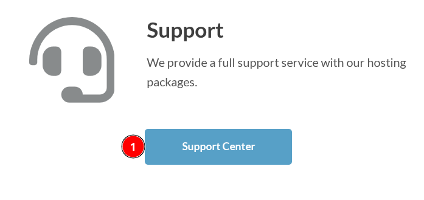
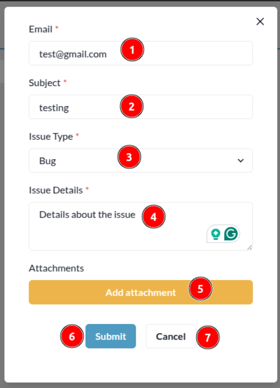
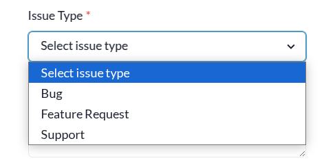
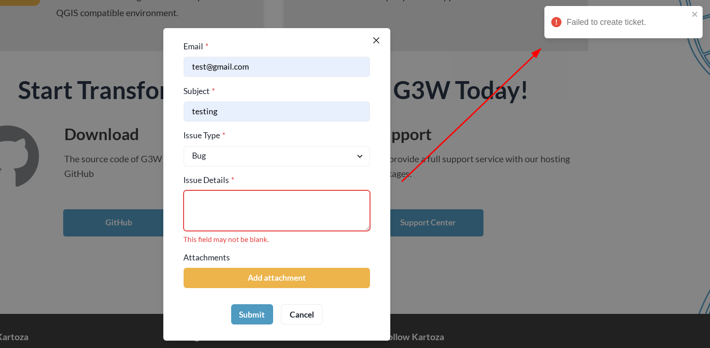

# Support Center

1. **Support Center:** Users can click on this button to access the support center. This will open a form.

1. **Email:** Users are required to enter their email address here, otherwise, their registered email will be used by default.

2. **Subject:** Users are required to enter a subject for their issue.

3. **Issue Type:** Users are required to select the type of issue they are reporting from the dropdown menu.

4. **Issue Details:** Users are required to enter a detailed description of their issue.

5. **Add Attachment:** Users can add attachments to their issue by clicking on the `Add attachment` button.

      * **1 Cancel:** Users can click on this button to cancel the attachment selection.
      * **2 Select:** After selecting the desired file users are required to click on this button to upload the attachment.'

6. **Submit:** After filling in all the required fields, users can submit their issue by clicking on this button.
      * **Error:** If users forget to fill in any `*` required field and click the submit button, they will receive the error message `This field may not be blank` below the input field, and a notification toast will appear with the message `Failed to create a ticket`.

      

      * **Success:** Users will be notified by a notification toast after the successful submission of the form.

      

7. **Cancel:** Users can click on this button to cancel the issue creation process.

 
